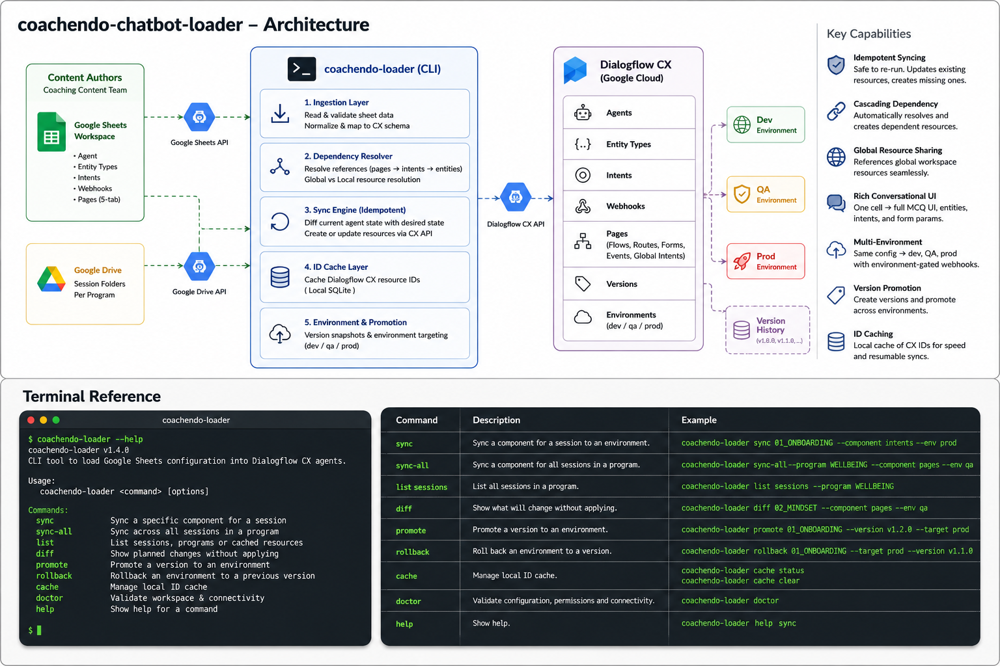

# coachendo-chatbot-loader

> **Internal CLI tool · Portfolio showcase.** Source code is proprietary.

A command-line tool that turns Google Sheets into fully deployed Dialogflow CX agents — built to let the Coachendo coaching team ship and maintain 50+ AI bots without touching the Dialogflow console.

---

## Background

Coachendo runs AI coaching bots across dozens of wellness programs. Each bot is a Dialogflow CX agent — with conversation flows, training phrases, entity types, webhooks, and deployment environments. Managing these manually through the Dialogflow UI doesn't scale.

I built this tool to move all bot configuration into Google Sheets (where the coaching content team already works) and give engineers a single CLI to publish, version, and deploy agents to any environment in one command.

---

## What It Does



```
coachendo-loader sync <session> --component <type> --env <prod|qa|dev>
```

Reads structured conversation config from a Google Sheets workspace, resolves all resource dependencies, and synchronises the full Dialogflow CX agent — from scratch or incrementally.

The same command works across all environments. The same sheets drive dev, QA, and production — no duplication, no config drift.

---

## Usage

### Sync a full agent end-to-end

```bash
# 1. Bootstrap the agent
coachendo-loader sync 01_ONBOARDING --component agents --env prod

# 2. Load vocabulary
coachendo-loader sync 01_ONBOARDING --component entityTypes --env prod
coachendo-loader sync 01_ONBOARDING --component intents --env prod

# 3. Connect fulfillment
coachendo-loader sync 01_ONBOARDING --component webhooks --env prod

# 4. Build conversation flows
coachendo-loader sync 01_ONBOARDING --component pages --env prod

# 5. Cut a release
coachendo-loader sync 01_ONBOARDING --component version --tag v1.2.0
coachendo-loader sync 01_ONBOARDING --component environment --target prod-release
```

### Incremental updates

Re-running any command is safe — the loader checks what already exists and updates rather than duplicates. Sheets are the source of truth; Dialogflow always converges to match them.

```bash
# Update just the intents after content team edits training phrases
coachendo-loader sync 03_RESILIENCE --component intents --env qa
```

### Multi-session batch sync

```bash
# Sync all sessions in a program
coachendo-loader sync-all --program WELLBEING --component pages --env prod
```

---

## How the Sheet-to-Agent Pipeline Works

Content authors work entirely in Google Sheets. Each coaching session has a folder in Google Drive with structured sheets per resource type:

```
📁 01_ONBOARDING/
├── 📋 Agent              →  agent name, language, timezone
├── 📋 _INDEX_ENTITIES    →  entity types (lists, synonyms, free-form values)
├── 📋 _INDEX_INTENTS     →  intents with training phrases + entity parameters
├── 📋 Webhooks           →  fulfillment URIs per environment
└── 📋 Pages/             →  conversation flow per page (5-tab structure)
    ├── Definition         →  entry messages
    ├── Routing            →  intent → target page transitions
    ├── Parameters         →  form fields tied to entity types
    ├── Event Handlers     →  no-match / no-input fallback chains
    └── Global Intents     →  shared intents across sessions
```

The loader reads all of these, resolves cross-references, and publishes the full agent structure via the Dialogflow CX API.

---

## Key Features

### Idempotent Syncing
Every resource is checked before creation. Already exists? It's updated. Doesn't exist? Created. Running the same sync twice produces the same agent state — safe for CI pipelines and partial re-runs after failures.

### Cascading Dependency Resolution
Pages reference intents. Intents reference entity types. If a page references an intent that hasn't been created yet, the loader resolves the dependency chain automatically — fetches the global intent definition, creates any entity types it needs, creates the intent, then wires the page transition. Content authors never need to think about ordering.

### Global Resource Sharing
Common vocabulary (yes/no, date formats, sentiment intents) is defined once in a shared global workspace and referenced by any session. The loader maintains a global cache and automatically routes references to the right scope — local or global — without any author configuration.

### Rich Conversational UI from Spreadsheets
Multiple-choice questions in a conversation flow are defined as a simple comma-separated option list in a cell. The loader expands this into a full Dialogflow MCQ interaction: creates the entity type for the options, generates the intent with training phrase variations, registers the form parameter, and encodes the chip UI as a proto3 struct payload. One cell → a complete interactive UI component.

### Multi-Environment Promotion
The same sheet config deploys to dev, QA, and production. Webhook URIs are environment-gated (filtered by an `env` column). Version snapshots (`v1.0.0`, `v1.1.0`) are created after each production sync and environments are pinned to specific versions — making rollback a one-line command.

### ID Caching Layer
Dialogflow resource IDs (long GCP path strings) are cached locally after creation. All subsequent operations resolve human-readable sheet names to Dialogflow paths through the cache — no repeated API lookups, and the pipeline is resumable if interrupted mid-sync.

---

## The Broader Toolchain

The loader is the **entry point** of a four-tool internal platform for the full bot lifecycle:

```
Google Sheets  ──►  coachendo-loader   ──►  Dialogflow CX Agent
                         │
                         ▼
               coachendo-trainer          Generates intent training phrase
               (DialoGPT + ML scoring)    variations; scores answer quality
                         │
                         ▼
               coachendo-tester           QA: validates conversation flows,
                                          intent matching, entity extraction
                         │
                         ▼
               coachendo-analytics        Apache Beam pipeline; consumes
               (GCP Dataflow → SQL)       Dialogflow logs → session metrics
```

Content authored in Sheets → published by loader → tested by tester → live in production → monitored by analytics → insights fed back to Sheets. A complete CI/CD loop for conversational AI.

---

## Impact

- Reduced new bot setup time from **days to under an hour**
- Enabled the coaching content team to author and iterate bots **without engineering involvement**
- Supported **50+ active Dialogflow CX agents** across multiple coaching programs and languages
- Multi-environment promotion workflow gave the team a reliable **dev → QA → prod pipeline** for chatbot releases for the first time

---

## Tech Stack

`Node.js` `Dialogflow CX API` `Google Sheets API` `Google Drive API` `Protocol Buffers` `GCP Service Accounts`

---

*Built by Ahmad Islam · [GitHub](https://github.com/ahmadaii)*

---

*License: Proprietary. All rights reserved.*
