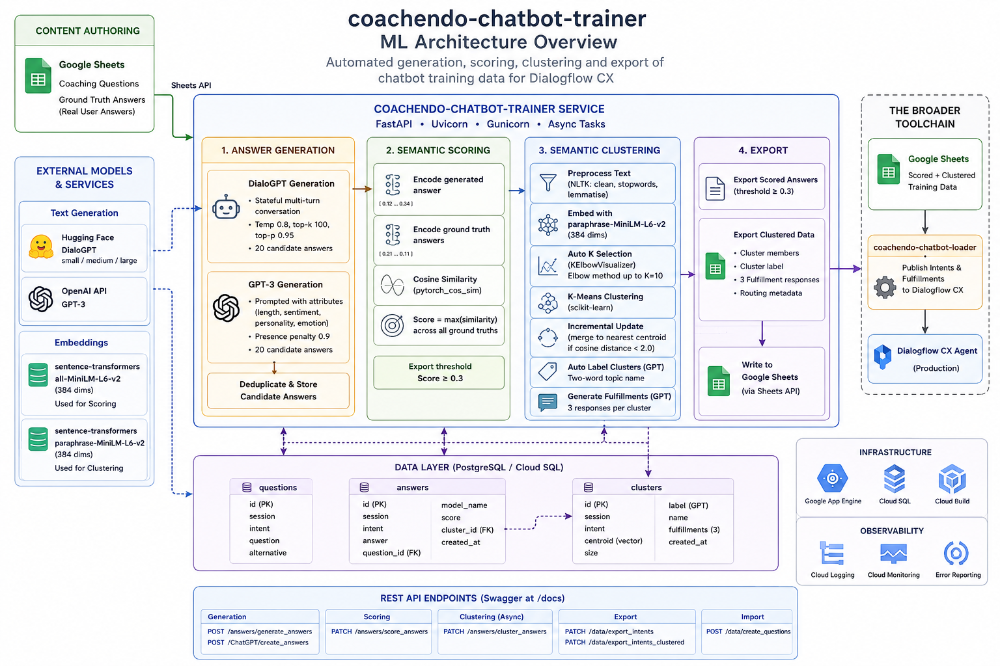

# coachendo-chatbot-trainer

> **Internal ML service · Portfolio showcase.** Source code is proprietary.

A machine learning microservice that automates the generation, scoring, and semantic clustering of chatbot training data — eliminating the need to manually write hundreds of intent variations for Dialogflow CX agents.

Built on sentence embeddings, K-Means clustering, and transformer-based text generation, it turns a single coaching question into a rich, clustered intent dataset ready for production deployment.

---

## Background

Training a Dialogflow CX chatbot to recognise natural language answers requires hundreds of real-world phrase variations per intent. Writing these by hand is slow, expensive, and produces biased coverage. For Coachendo — running 50+ coaching bots across multiple programs — doing this manually wasn't feasible.

I built the trainer as a REST API that handles the full ML pipeline: generate diverse answer candidates using language models, score them against real user answers, cluster semantically similar responses, and export the final dataset back to Google Sheets for the loader to publish into Dialogflow.

---

## ML Pipeline



---

## How Each Stage Works

### 1. Answer Generation

Two complementary generation strategies run in parallel to maximise linguistic diversity:

**DialoGPT (Microsoft)**
- `microsoft/DialoGPT-small|medium|large` loaded from HuggingFace
- Stateful generation: maintains conversation history token IDs across turns, producing coherent multi-turn responses
- Temperature `0.8`, top-k `100`, top-p `0.95` — tuned for diversity without incoherence
- Generates 20 candidate answers per question; chat history reset between iterations to prevent repetition

**GPT-3 (OpenAI)**
- Prompted with configurable attributes: `length`, `sentiment`, `personality`, `emotion`
- Prompt instructs the model to avoid echoing question keywords — forcing genuine paraphrase
- Presence penalty `0.9` discourages surface-level repetition across the 20 outputs
- Returns a single completion split on newlines into individual answers

Both strategies write to the same `answers` table, deduplicated before insertion.

### 2. Semantic Scoring

Every generated answer is scored against real user answers collected in Google Sheets:

1. Encode the generated answer with `sentence-transformers/all-MiniLM-L6-v2` (384-dim embeddings)
2. Encode all ground-truth user answers for that intent
3. Compute pairwise cosine similarity using `pytorch_cos_sim`
4. **Score = max similarity** across all ground-truth answers — rewards answers that closely match at least one real user response
5. Answers scoring below `0.3` are filtered out at export time

This ensures only semantically relevant candidates make it into Dialogflow training data — not just fluent but irrelevant text.

### 3. Semantic Clustering

High-scoring answers are clustered to organise intent variants into meaningful response groups, each backed by distinct fulfillment text:

1. **Preprocessing** — NLTK pipeline: punctuation removal, stopword filtering, lemmatisation
2. **Embedding** — `sentence-transformers/paraphrase-MiniLM-L6-v2` (separate model optimised for semantic similarity)
3. **Auto K-selection** — `KElbowVisualizer` (Yellowbrick) finds optimal cluster count up to K=10 using the elbow method — no manual tuning required
4. **K-Means clustering** — `scikit-learn` groups semantically similar answers
5. **Incremental updates** — new answers compared to existing cluster centroids; merged into nearest cluster if cosine distance `< 2.0`, otherwise a new cluster is created. Centroids updated via running mean — no full re-clustering on each run
6. **Cluster labelling** — GPT generates a two-word topic name per cluster from its member answers
7. **Fulfillment generation** — GPT generates 3 short conversational responses per cluster, used as the bot's reply when that cluster of answers is matched

### Dual Embedding Model Strategy

Two different sentence-transformer models are used deliberately:

| Model | Used For | Why |
|---|---|---|
| `paraphrase-MiniLM-L6-v2` | Clustering | Optimised for paraphrase detection — better semantic grouping |
| `all-MiniLM-L6-v2` | Scoring | Broader semantic coverage — better for similarity against diverse ground-truth answers |

---

## API

Deployed on **Google App Engine**, accessible via Swagger at `/docs`.

### Generate answers
```bash
# DialoGPT generation
POST /answers/generate_answers?session=01_ONBOARDING&ml_model=microsoft/DialoGPT-medium&generate_limit=20

# ChatGPT generation with attributes
POST /ChatGPT/create_answers?session=01_ONBOARDING&length=short&sentiment=positive&number_of_answers=20
```

### Score answers
```bash
PATCH /answers/score_answers?session=01_ONBOARDING
```

### Cluster answers
```bash
# Runs as async background task
PATCH /answers/cluster_answers?session=01_ONBOARDING
```

### Export to Google Sheets
```bash
# Export scored answers (threshold ≥ 0.3)
PATCH /data/export_intents?session=01_ONBOARDING&intents=yes_intent,no_intent

# Export clustered answers with fulfillments + routing
PATCH /data/export_intents_clustered?session=01_ONBOARDING&intents=yes_intent,no_intent
```

### Import questions
```bash
POST /data/create_questions?session=01_ONBOARDING
```

---

## Data Model

```
questions
  id · session · intent · question · alternative

answers
  id · session · intent · answer · question_id (FK)
  model_name · score · cluster_id (FK)

clusters
  id · session · intent · centroid · size
  label · name (GPT-generated topic) · fulfillments (3 strings)
```

---

## The Broader Toolchain

The trainer sits between content authoring and Dialogflow deployment:

```
Google Sheets (coaching questions)
    │
    ▼
coachendo-chatbot-trainer   ◄── This service
    │  Generate → Score → Cluster → Export
    ▼
Google Sheets (scored + clustered training data)
    │
    ▼
coachendo-chatbot-loader
    │  Publish intents + fulfillments to Dialogflow CX
    ▼
Dialogflow CX Agent (production)
```

---

## Tech Stack

| Layer | Technology |
|---|---|
| **API** | FastAPI, Uvicorn, Gunicorn |
| **ML / Embeddings** | `sentence-transformers` (paraphrase-MiniLM-L6-v2, all-MiniLM-L6-v2) |
| **Clustering** | `scikit-learn` KMeans, `yellowbrick` KElbowVisualizer |
| **Text Generation** | HuggingFace Transformers (DialoGPT), OpenAI API (GPT-3) |
| **NLP Preprocessing** | NLTK (stopwords, lemmatisation, tokenisation) |
| **Dimensionality Reduction** | UMAP (available) |
| **Database** | PostgreSQL, SQLAlchemy ORM, Google Cloud SQL |
| **Integrations** | Google Sheets API, Google Drive API |
| **Deployment** | Google App Engine, Cloud Build |

---

## What This Demonstrates

- **End-to-end ML pipeline engineering** — embedding generation, cosine similarity scoring, auto-K clustering, and LLM-augmented label generation composed into a single coherent REST service
- **Incremental clustering** — centroids updated with running mean arithmetic rather than re-clustering from scratch, keeping the pipeline efficient as answer volumes grow
- **Dual-model generation strategy** — combining a stateful conversational LM (DialoGPT) with a prompted instruction model (GPT-3) to maximise lexical and stylistic diversity in training data
- **Dual embedding model selection** — deliberate use of different sentence-transformer models for clustering vs. scoring based on their respective optimisation objectives
- **Ground-truth-anchored quality filtering** — cosine similarity against real user answers as the quality gate, ensuring only semantically valid candidates enter Dialogflow training data
- **Automated cluster semantics** — GPT-generated two-word topic labels and fulfillment responses turn unlabelled embedding clusters into human-readable, deployment-ready intent groups

---

*Built by Ahmad Islam · [GitHub](https://github.com/ahmadaii)*

---

*License: Proprietary. All rights reserved.*
