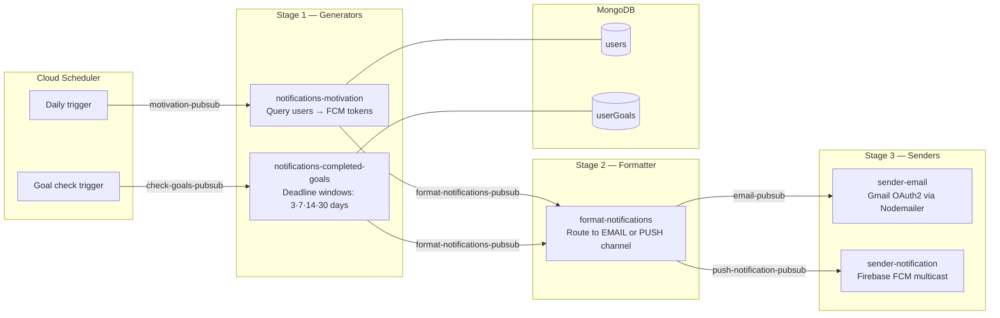

# coachendo-events

> **Internal service · Portfolio showcase.** Source code is proprietary.

An event-driven notification engine built on Google Cloud Functions and Pub/Sub, delivering timely push notifications and emails to Coachendo coaching app users — goal deadline reminders, daily motivation, and feedback prompts — through a fully asynchronous, multi-stage serverless pipeline.

---

## Background

Keeping coaching app users engaged between sessions is critical to program completion. Rather than coupling notification logic into the main application, I built this as a standalone event-driven microservice system — each stage independent, each function single-purpose, connected entirely through Pub/Sub topics.

The result is a notification engine that scales horizontally, retries failed deliveries automatically, and can be extended with new event types without touching existing code.

---

## Architecture



---

## How It Works

### Stage 1 — Event Generators

Two Cloud Functions query MongoDB and publish events to the formatter topic.

**Motivation Notifications**
- Runs daily via Cloud Scheduler
- Queries all active, verified users with registered FCM tokens
- Deduplicates tokens (`new Set`) before publishing
- Publishes one event per user to the formatter

**Goal Deadline Reminders**
- Queries mandatory goals with `maxDate` falling within 4 deadline windows
- Uses `Promise.all` to run all four window checks in parallel:

```
3 days  →  daysAfter(2) to daysAfter(4)
7 days  →  daysAfter(6) to daysAfter(8)
14 days →  daysAfter(13) to daysAfter(15)
30 days →  daysAfter(29) to daysAfter(31)
```

- Skips already-completed goals (`numActivitiesCompleted === numActivitiesTotal`)
- Skips unverified users

### Stage 2 — Formatter

A single Cloud Function receives all events and routes to the correct delivery channel:
- `channel: EMAIL` → publishes to `email-pubsub`
- `channel: PUSH` → publishes to `push-notification-pubsub`

Clean separation: generators don't know about delivery; senders don't know about business logic. Both channels can be triggered by the same event.

### Stage 3 — Senders

**Email Sender**
- Nodemailer with Gmail OAuth2 authentication
- HTML email templates (inline CSS) — separate templates for goal reminders and user feedback
- Environment suffix (`[DEV]`, `[QA]`) appended to non-production messages for safe testing

**Push Notification Sender**
- Firebase Admin SDK — `messaging().sendMulticast()` delivers to multiple device tokens in a single API call
- Supports iOS and Android simultaneously via FCM

---

## Key Design Decisions

**Single-purpose functions** — each Cloud Function does exactly one thing. Adding a new notification type means adding a new generator, not modifying existing code.

**Pub/Sub as the integration layer** — functions are fully decoupled. A generator doesn't need to know how many channels exist or how delivery works. Pub/Sub handles retries automatically if a downstream function fails.

**MongoDB disconnect on completion** — each function explicitly closes the MongoDB connection after its query. Prevents connection pool exhaustion in a serverless environment where function instances are reused unpredictably.

**Parallel deadline window queries** — `Promise.all` runs all four `userGoals` queries concurrently instead of sequentially, cutting MongoDB query time to the duration of the slowest single window check.

**Environment-gated messaging** — staging and dev functions append environment labels to notification bodies, making it impossible to confuse test notifications with production ones.

---

## Deployment

Branch-based CI/CD via Google Cloud Build. Merging to `dev`, `qa`, or `prod` automatically deploys all functions to their respective GCP project.

```yaml
# Each function deploys independently
gcloud functions deploy notifications-motivation \
  --runtime nodejs16 \
  --trigger-topic motivation-pubsub \
  --region europe-central2 \
  --entry-point handler
```

| Function | Trigger | Region |
|---|---|---|
| `notifications-motivation` | `motivation-pubsub` | europe-central2 |
| `notifications-completed-goals` | `check-goals-pubsub` | europe-central2 |
| `format-notifications` | `format-notifications-pubsub` | europe-central2 |
| `sender-email` | `email-pubsub` | europe-central2 |
| `sender-notification` | `push-notification-pubsub` | europe-central2 |

---

## Tech Stack

`Node.js 16` `Google Cloud Functions` `Google Cloud Pub/Sub` `Cloud Scheduler` `Cloud Build` `Firebase FCM` `MongoDB` `Mongoose` `Nodemailer` `Gmail OAuth2`

---

## What This Demonstrates

- **Event-driven microservices** — a real-world pub/sub pipeline where every stage is independently deployable, scalable, and testable
- **Serverless design discipline** — explicit connection lifecycle management, single-purpose functions, and stateless handlers built for Cloud Functions' execution model
- **Multi-channel notification routing** — a single formatter stage cleanly separates channel decision logic from both generation and delivery, making it trivial to add SMS or Slack without touching generators or senders
- **Branch-based CI/CD for serverless** — Cloud Build configuration that maps git branches to GCP environments, giving the team a safe dev → QA → prod promotion workflow

---

*Built by Ahmad Islam · [GitHub](https://github.com/ahmadaii)*

---

*License: Proprietary. All rights reserved.*
