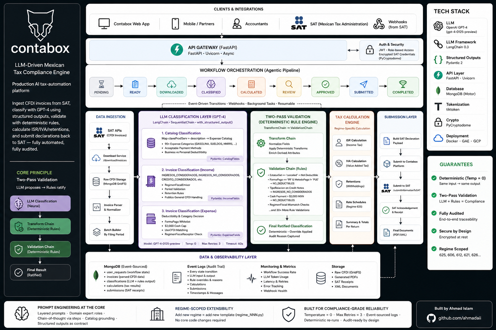
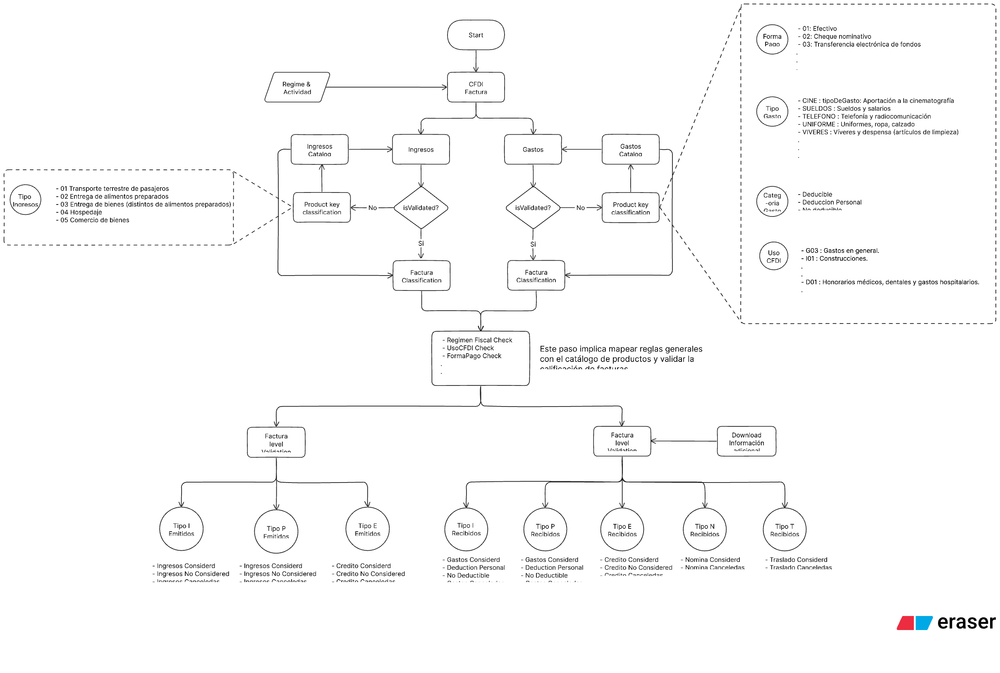

# contabox

> **Production AI tax-automation platform · Portfolio showcase.** Source code is proprietary.

An LLM-driven Mexican tax compliance engine that ingests CFDI electronic invoices from the SAT (Mexican Tax Administration), classifies them by deductibility and tax regime using GPT-4 with structured outputs, computes ISR/IVA/retentions, and submits the final declarations back to the SAT — fully automated, fully audited.

A compliance-critical use case where a model hallucination is a tax filing error. Built around a **two-pass validation architecture**: the LLM proposes classifications, a deterministic rule engine ratifies them, and every step is logged.

---

## Background

Mexican professionals operating under tax regime 625 file periodic returns to the SAT. Each return depends on classifying every invoice they received or issued — by income type, deductibility, payment method, and dozens of regime-specific rules baked into the *Ley del ISR* and *Ley del IVA*. A typical accountant does this manually in spreadsheets; a missed classification means an audit or a fine.

Contabox automates the whole loop end-to-end:

1. **Pull** every CFDI for the filing period directly from the SAT
2. **Classify** each one with an LLM, grounded in a catalog of SAT product/service codes
3. **Validate** every classification against deterministic deductibility rules
4. **Calculate** ISR, IVA, and retentions per the regime's rate schedule
5. **Submit** the final declaration back to the SAT — and produce a full audit trail

The AI is doing the work an experienced accountant would do — but for hundreds of users in parallel, and in seconds.

---

## Architecture



---

## Prompt Engineering — The Core of the System

Contabox is, at its heart, a **prompt engineering system**. Every classification decision flows through carefully constructed prompts that combine: a domain-expert role, regime-specific rule sets, a catalog of allowable SAT codes, and a strict structured output schema. The LLM is not generating prose — it's filling a Pydantic schema under hard constraints.

### Layered Prompt Architecture

Three distinct prompt layers, each with its own template, role definition, and rule corpus:

| Layer | Purpose | Domain rules embedded |
|---|---|---|
| **Catalog classification** | Map SAT `claveProdServ` codes + description text to a known expense category (90+ types: GASOLINA, SUELDOS, HNRRS, ASISTTEC, …) | Acceptable payment methods, business-vs-personal deductibility, expense-type taxonomy |
| **Invoice classification (income)** | Decide if a received invoice counts as INGRESOS_CONSIDERADOS, INGRESOS_NO_CONSIDERADOS, CREDITO_CONSIDERADOS, etc. | RegimenFiscalEmisor check, period validation, Publico General CFDI handling, retention rules |
| **Invoice classification (expense)** | Decide if an outgoing payment is deductible and under which category | FormaPago whitelist, $2,000 cash cap, UsoCFDI matching, RegimenFiscalReceptor check |

Each layer is regime-scoped — `regime_625.py` is the production template, with stubs for 606, 612, 621, 626 sitting alongside it. Switching a user's regime swaps the entire prompt stack; rules don't bleed between regimes.

### Structured Outputs as the Contract

Every prompt uses LangChain's `with_structured_output()` bound to a Pydantic schema (`CFDIClassificationFields`, `IncomeFields`, `ExpenseFields`). If the model doesn't produce a schema-conforming object, the call fails loudly — there is no "let's try to parse the JSON" salvage layer. The downstream tax-calculation code can treat LLM output as typed data, not strings.

### Chain-of-Thought via Step Definition

Each invoice prompt explicitly lists the reasoning steps the model must perform:

1. Iterate the batch of CFDIs
2. For each one, extract its `conceptos` (line items)
3. For each concepto, match against the catalog by `claveProdServ` + description
4. Apply regime-specific deductibility rules
5. Map to the final tax category

This isn't free-form CoT — the prompt enumerates the procedure. The model fills in the answers; the algorithm is fixed.

### Domain Expert Role Definitions

Every system prompt starts with a tightly-scoped role: *"You are a classification model designed to perform income classification on a batch of invoices under the Mexican tax regime 625"*. No "be helpful, be polite" boilerplate — just precise domain authority.

### Few-Shot Anchoring via Catalog

The expense catalog itself functions as a few-shot context. The LLM sees the full enumeration of 90+ SAT codes with their canonical descriptions and acceptable rules, which constrains its output to a known vocabulary and prevents free-form invention of categories.

### Bilingual Explanations

Every classification result includes a Spanish-language human-readable explanation of *why* the model classified the invoice that way. This isn't decorative — it's the audit artefact that gets reviewed when a filing is challenged.

---

## Two-Pass Validation — LLM First, Rules Second

A compliance system cannot trust a model alone. Contabox's signature pattern: every LLM classification is run through a **deterministic transform chain** that re-checks invoice-level rules and overrides the model when it gets them wrong.



Examples of overrides the rule layer applies:

- **EstatusSat == 'canceled'** → force `EsDeductible = false`, regardless of LLM output
- **FormaPago == '99'** (deferred payment) + **MetodoPago != 'PUE'** → force `NO_DEDUCTIBLES`
- **TipoRelacion** flags on credit notes → force `INGRESOS_NO_CONSIDERADOS`
- **Cash payment over $2,000 MXN** → force `NO_DEDUCTIBLES` on that line item

The result is a hybrid pipeline: the LLM does the *judgment calls* (interpreting line-item descriptions, picking the right expense category), and the rule engine does the *bright-line compliance calls* (anything the SAT has codified in regulation). Neither side is asked to do the other's job.

---

## Agentic Workflow Orchestration

The full filing cycle is orchestrated as a multi-stage workflow with explicit state transitions:

```
PENDING ──► READY ──► DOWNLOADED ──► CLASSIFIED ──► CALCULATED ──► REVIEW ──► APPROVED ──► SUBMITTED ──► COMPLETED
```

Each transition is webhook-driven or background-task-driven, recorded to MongoDB with a timestamp and message, and recoverable from failure mid-flow. The SAT itself notifies Contabox when invoice data is ready to download (via `/webhook/informationReadyToDownload`), kicking off the rest of the pipeline asynchronously.

LangChain's `SequentialChain` composes the LLM classification, transform validation, and final ratification chain into a single callable unit — but the inter-stage workflow (download → classify → calculate → submit) runs as FastAPI background tasks coordinated by MongoDB state.

---

## Engineering Decisions That Matter

### Temperature = 0, Always
Tax classification cannot be probabilistic. Every LLM call sets `temperature=0` to eliminate sampling randomness. Two filings of the same data must produce the same result.

### Max Retries = 3
Every `ChatOpenAI` instance is configured with `max_retries=3` and `timeout=60s`. Transient OpenAI errors don't fail the workflow — they're absorbed and retried at the SDK layer.

### Catalog-as-Knowledge-Base (RAG without Vectors)
Contabox doesn't need a vector store. The expense catalog is a finite, canonical document — passed verbatim into the prompt as grounding context. This is RAG by injection, not retrieval — appropriate when the knowledge base is small, fixed, and structurally indexed by code.

### Regime-Scoped Template Branching
Adding support for a new SAT regime (621, 626, …) means writing a new `regime_NNN.py` template — no changes to classification chains, calculation engines, or workflow code. The system is one regime-extension away from being a multi-regime SaaS.

### Pydantic-Enforced Schema Contract
The LLM does not emit strings that need parsing; it emits structured objects validated by Pydantic models at the LangChain boundary. The downstream tax-calculation code is fully typed from end to end.

### MongoDB as Event-Sourced Audit Log
Every state change is appended to a `logs[]` array on the `user_requests` document. The full history of a filing — what was downloaded, what was classified, what the LLM said, what the rules overrode, what was submitted — is reconstructible from the document.

---

## API Surface

| Method | Endpoint | Purpose |
|---|---|---|
| `POST` | `/api/userDeclarationRequest` | Initiate a new tax filing |
| `POST` | `/webhook/informationReadyToDownload` | SAT-driven webhook trigger |
| `POST` | `/downloadInvoices` | Fetch CFDIs from SAT |
| `POST` | `/CFDIInvoiceClassification` | Run LLM classification on the batch |
| `POST` | `/calculateImpuesto` | Calculate ISR / IVA / retentions |
| `POST` | `/submitInformationToContabox` | Push results to Contabox platform |
| `POST` | `/submitInformationToSAT` | Submit declaration to SAT |
| `POST` | `/workflows/process-requests` | Run the full background workflow |

---

## Tech Stack

| Layer | Technology |
|---|---|
| **LLM** | OpenAI GPT-4 (`gpt-4-0125-preview`), `temperature=0`, `max_retries=3` |
| **LLM Framework** | LangChain 0.3 · `with_structured_output` · `SequentialChain` · `TransformChain` |
| **Structured Outputs** | Pydantic 2 · `CFDIClassificationFields` · `IncomeFields` · `ExpenseFields` |
| **API** | FastAPI · Uvicorn · async background tasks |
| **Database** | MongoDB (event-sourced filings) · Motor async driver |
| **Tokenisation** | tiktoken |
| **Domain Layer** | SAT product/service catalog · regime-scoped prompt templates · two-pass validation |
| **Crypto** | PyCryptodome (SAT credential encryption at rest) |
| **Deployment** | Docker · Google App Engine · GCP |

---

## What This Demonstrates

- **Deep prompt engineering for high-stakes domains** — layered prompts (catalog → invoice → validation), explicit role definitions, embedded rule corpora, chain-of-thought via enumerated procedure, catalog-as-grounding-context, and Pydantic-enforced structured outputs. Every prompt is a contract, not a request.
- **Two-pass hybrid AI architecture** — LLM for judgment calls, deterministic rule engine for bright-line compliance calls. The pattern that makes LLMs viable in regulated domains (tax, healthcare, legal, finance) where pure-AI solutions are non-starters.
- **Production agentic orchestration** — multi-stage LangChain SequentialChain composed with MongoDB-tracked workflow state, webhook-triggered transitions, and resumable failure recovery. The whole filing cycle is one coherent agentic pipeline, not a script.
- **Regime-scoped extensibility** — adding a new Mexican tax regime requires a new template file, not new code. The architecture treats compliance rules as data.
- **Structured-output discipline** — `with_structured_output()` bound to Pydantic schemas means the LLM is generating *typed objects*, not text to be parsed. The downstream calculator never touches a JSON string.
- **Compliance-grade reliability engineering** — `temperature=0` for determinism, `max_retries=3` for transient failures, event-sourced audit logs for regulator-grade traceability, encrypted SAT credentials at rest, deterministic re-runs of the same input produce the same output.
- **Real-world ROI** — replacing accountant-hours-per-filing with seconds-of-compute, while producing a more rigorous audit trail than a human would generate.

---

*Built by Ahmad Islam · [GitHub](https://github.com/ahmadaii)*

---

*License: Proprietary. All rights reserved.*
