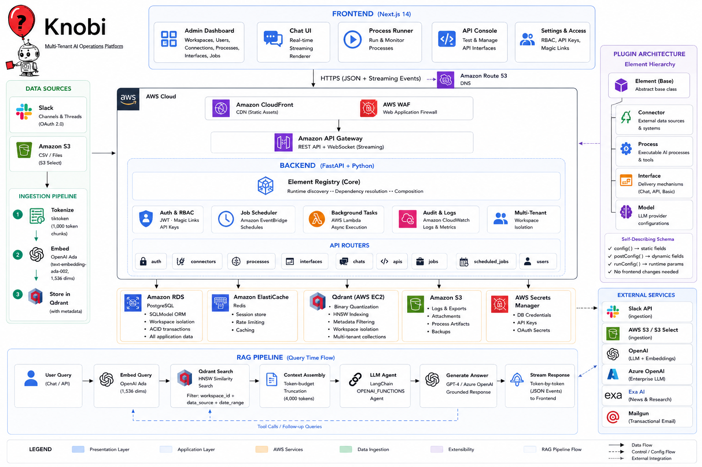

<p align="center">
  <h1 align="center">Knobi</h1>
  <p align="center">
    Multi-Tenant AI Operations Platform — RAG pipelines, LLM agent orchestration, and no-code workflow automation at enterprise scale.
  </p>
</p>

> **Portfolio project.** This repository is a public showcase of the architecture, design decisions, and engineering work behind Knobi. Source code is proprietary.

---

## What Is Knobi?

Knobi is a **production-grade, multi-tenant SaaS platform** that lets teams build and deploy intelligent AI workflows through a no-code visual interface — no engineering required after initial setup.

At its core, Knobi is a **RAG (Retrieval-Augmented Generation)** engine wrapped in a composable operations platform. Teams connect their data sources (Slack, S3), configure LLM-powered processes, and publish them as streaming chat interfaces, scheduled jobs, or authenticated REST APIs — all managed through a single admin dashboard with full workspace isolation, RBAC, and audit trails.

---

## The Problem It Solves

Most organizations sit on enormous amounts of unstructured knowledge — Slack thread history, internal CSVs in S3, documents — but have no systematic way to make that knowledge queryable or actionable by AI. Building a custom RAG pipeline for each use case requires specialized engineering work every time.

Knobi abstracts that complexity into a **self-describing plugin system**. A new data source, AI process, or delivery interface is registered once and becomes immediately available to all tenants through configuration — no new deployments, no frontend changes, no repeated engineering lift.

---

## RAG Pipeline — How It Works

Knobi implements a complete, production-grade Retrieval-Augmented Generation pipeline from ingestion to streaming answer delivery.

### Data Ingestion

| Source | Mechanism |
|---|---|
| **Slack** | OAuth 2.0 connection; ingests channel history and threaded conversations with pagination |
| **AWS S3** | Streams CSV records via S3 Select for memory-efficient processing |

Each source feeds a shared ingestion pipeline:
1. **Tokenize** with `tiktoken` at 1,000-token chunk boundaries — preserving semantic coherence
2. **Embed** each chunk with **OpenAI Ada** (`text-embedding-ada-002`, 1,536 dimensions)
3. **Store** in **Qdrant** with rich metadata payloads (source, channel, timestamp, URL, data source tag)

### Vector Store (Qdrant)
- **Binary quantization** for memory-efficient storage at scale
- **HNSW indexing** for fast approximate nearest-neighbor search
- **Metadata filtering** on every query: by data source, channel, date range, and workspace ID
- **Multi-tenant isolation**: tenant prefix + `workspace_id` payload filter — tenants never see each other's vectors

### Retrieval & Context Assembly
- User query → embedded via OpenAI Ada → vector similarity search in Qdrant
- Metadata filters applied at query time (configurable per process)
- **Token-budget truncation**: results capped at 4,000 tokens to prevent prompt overflow
- Retrieved chunks returned as JSON-formatted context to the LLM agent

### Answer Generation
- **LangChain OPENAI_FUNCTIONS** agent receives the retrieved context
- Generates a grounded answer citing the source material
- Response streamed **token-by-token** to the user via async generators + FastAPI `StreamingResponse`

---

## Architecture



---

## Key Features

### LLM Agent Orchestration
- **LangChain OPENAI_FUNCTIONS** agent with full `ConversationBufferMemory`
- Supports **OpenAI GPT-4** and **Azure OpenAI** — switchable per workspace configuration
- Any registered Process automatically becomes a LangChain `StructuredTool` with a Pydantic-derived input schema — no manual tool wiring
- Custom `AsyncCallbackHandler` captures token and tool-use events for real-time streaming

### Intelligent Built-In Processes

| Process | What It Does |
|---|---|
| **Qdrant Semantic Search** | Embeds a query, searches the vector store with metadata filters, returns token-budget-truncated ranked chunks |
| **News Digest** | Fetches recent articles via Exa AI, uses LLM structured output to curate top 5 stories, returns a markdown summary |
| **Competitor Research** | Given a URL, discovers similar companies, fetches full site content, scores each for differentiation, strengths, and weaknesses |
| **News Search (Tool)** | Lightweight real-time news lookup designed for use as an agent tool mid-conversation |

### Flexible Delivery Layer

| Interface Type | Use Case |
|---|---|
| **Chat Interface** | Streaming conversational AI — tokens rendered live as they arrive |
| **Basic Interface** | Run a process on demand, view structured logs and results |
| **API Interface** | Expose any process as an authenticated REST endpoint with configurable defaults and per-user API keys |

### Multi-Tenant Workspace System
- Full data isolation: every record carries a `workspace_id` foreign key — tenants never touch each other's data
- Three-tier RBAC: `owner` → `admin` → `user`
- Granular interface-level access: users only see the AI capabilities explicitly granted to them
- Workspace-scoped API keys for programmatic integration

### Job Scheduling Engine
- Hourly / daily schedules with hour-of-day targeting
- Asynchronous background execution via FastAPI `BackgroundTasks`
- Job lifecycle tracking: `running` → `success` / `error`
- Full result + log persistence for auditing and replay

### No-Code Admin UI
- Every element self-describes its configuration schema in code — the frontend renders the correct form controls dynamically
- Schema field types: `text`, `longtext`, `password`, `choice` (single/multi), `element` (nested element reference), `oauth`
- Two-phase configuration: static fields first, then dynamic fields fetched from live external state (e.g., available Slack channels after OAuth connection)
- Zero frontend changes needed to add a new plugin or data source

---

## Notable Engineering Decisions

### Self-Describing Plugin Architecture
Every element class declares a `config()` classmethod returning a typed field schema. The frontend reads this schema at runtime to render the correct input controls — dropdown, text, OAuth button, or a reference picker for nested elements. Adding a new connector or process type requires **zero frontend changes**.

```python
@classmethod
def config(cls):
    return {
        "chat_model": {
            "display": "Large Language Model (LLM)",
            "help": "Select which chat LLM to use",
            "type": "element",       # references another registered element
            "element": "Model",
            "required": True,
        },
        "tools": {
            "display": "Tools",
            "type": "element",
            "element": "Process",
            "multi": True,           # agent can hold multiple tool processes
            "required": False,
        },
        "instructions": {
            "display": "Instructions",
            "required": True,
            "type": "longtext",
            "help": "Passed to the assistant as the system prompt"
        },
    }
```

Elements also declare two additional lifecycle methods:

```python
def postConfig(self):
    # Called after initial config is saved — fetches live external state
    # e.g., returns available Slack channels after OAuth token is stored
    return {"channels": {"type": "choice", "options": self.list_channels()}}

def runConfig(self):
    # Defines per-execution parameters (used to generate StructuredTool schema)
    return {"query": {"type": "text", "required": True}}
```

Elements are registered at startup via a central registry:

```python
from knobi.utils import register
from .connectors.slack import SlackOauthConnector
from .processes.agent import SimpleChatAgent

register(SlackOauthConnector, {'name': 'SlackOauthConnector', 'namespace': 'knobi'})
register(SimpleChatAgent,     {'name': 'SimpleChatAgent',     'namespace': 'knobi'})
```

The registry enables runtime discovery by type — `listType(Process)` returns all registered Process subclasses, which is how the admin UI populates dropdowns and how agents auto-discover available tools.

### Dynamic Dependency Resolution
When a process or interface is executed, `instantiateItem()` recursively resolves its full dependency tree:

1. Load the element's database record
2. Look up the registered class by `element_name` + `element_namespace`
3. For each setting of type `element`, recursively instantiate the referenced element
4. Construct the full object graph with all dependencies resolved

This enables arbitrarily deep composition — a Chat Interface references a Chat Agent, which references an LLM Model and multiple Tool Processes, each of which may reference their own Connectors and Qdrant instances — all resolved automatically at runtime from stored configuration, with no manual wiring code.

### Streaming Event Protocol
The backend emits newline-delimited JSON with typed events over a single HTTP streaming response:
```json
{"type": "token",       "content": "The answer is..."}
{"type": "action",      "content": "Searching knowledge base..."}
{"type": "first_token", "content": ""}
{"type": "fin",         "content": ""}
```
The frontend consumes `Response.body.getReader()` and dispatches each event to the appropriate UI handler — tokens append live, action events show tool-use indicators, and `fin` closes the stream cleanly.

### Multi-Tenant Vector Isolation
Qdrant collections are prefixed with a tenant-specific identifier. Within a collection, every vector payload carries `workspace_id` and `data_source` metadata. All search queries include filter conditions on both fields — tenants are isolated at both the collection and payload level, with defense in depth.

### Structured LLM Output
Processes like News Digest and Competitor Research use LangChain's `with_structured_output()` to bind Pydantic models to LLM responses. This converts free-form generation into typed, validated data structures that feed directly into downstream logic — no prompt-parsing hacks, no fragile regex extraction.

### Post-Configuration Pattern
Elements can declare a `postConfig()` method that runs after initial settings are saved, fetching live external state to populate dynamic form fields. For example, after a Slack OAuth connection is established, `postConfig()` calls the Slack API to list available channels for the user to select from. This enables a guided, multi-step configuration flow without building a custom wizard for each integration.

---

## Tech Stack

| Layer | Technology |
|---|---|
| **Frontend** | Next.js 14 (App Router), React 18, TailwindCSS, SWR, Remark + Rehype |
| **Backend** | FastAPI, Python, Uvicorn, Pydantic |
| **ORM / Database** | SQLModel, PostgreSQL |
| **Vector Store** | Qdrant (gRPC, binary quantization, HNSW indexing) |
| **LLM / Agents** | LangChain, OpenAI GPT-4, Azure OpenAI |
| **Embeddings** | OpenAI Ada (`text-embedding-ada-002`, 1,536 dimensions) |
| **Tokenization** | tiktoken |
| **Data Sources** | Slack SDK, AWS Boto3 (S3 + S3 Select) |
| **Web Research** | Exa AI (semantic news + competitor discovery) |
| **Auth** | JWT (python-jose), bcrypt, OAuth 2.0, Magic Links |
| **Email** | Mailgun (transactional) |
| **Scheduling** | FastAPI BackgroundTasks |

---

## Security Model

- Passwords hashed with `bcrypt` — never stored in plain text
- JWTs signed with HS256, configurable expiration (default 30 minutes)
- Magic links are single-use tokens invalidated on first access
- All API endpoints enforce `get_current_active_user` dependency injection via FastAPI
- RBAC enforced at the router level — regular users cannot reach admin endpoints regardless of token
- API keys are 13-character URL-safe tokens scoped to a single user + interface pair
- CORS configured to an explicit origin allowlist (no wildcard in production)
- Qdrant access gated behind API key authentication over gRPC

---

## Data Model

```
Workspace ──┬── Member (role: owner / admin / user)
            │     └── User (email, bcrypt hash, status)
            │
            ├── Connection         (external data source configs)
            ├── Process            (AI process + tool configs)
            ├── Interface          (delivery configs: chat, basic, API)
            ├── Model              (LLM provider configs)
            │
            ├── ScheduledJob       (cron-like scheduling rules)
            ├── Job                (execution records + results)
            │
            ├── ApiKey             (programmatic access tokens)
            ├── MagicLink          (one-time passwordless auth tokens)
            └── UserInterfaceAccess (granular per-user access control)
```

---

## Third-Party Integrations

| Service | Role |
|---|---|
| **Slack** | OAuth 2.0 connector; ingests channel history and threaded conversations |
| **AWS S3** | Streams CSV records via S3 Select for memory-efficient vectorization |
| **OpenAI** | LLM inference (GPT-4) + Ada embeddings |
| **Azure OpenAI** | Enterprise LLM alternative with the same LangChain interface |
| **Qdrant** | Vector storage, binary-quantized HNSW search |
| **Exa AI** | Semantic news search and competitor discovery by URL |
| **Mailgun** | Transactional email (magic links, invitations) |
| **LangChain** | Agent orchestration, tool wrapping, structured output, memory |

---

## Project Structure

```
knobi-mt/
├── backend/
│   ├── main.py                  # FastAPI app, CORS, router registration, DB init
│   ├── db/models.py             # SQLModel ORM definitions (all entities)
│   ├── knobi/
│   │   ├── elements.py          # Abstract element hierarchy (base classes)
│   │   └── utils.py             # Registry, instantiation, dependency resolution
│   ├── package/                 # Plugin packages (the extensible core)
│   │   ├── connectors/          # Slack OAuth, AWS S3, Qdrant, Exa AI
│   │   ├── processes/           # Loaders, agents, search, news digest, competitor research
│   │   ├── interfaces/          # Chat, Basic, API interfaces
│   │   └── models/              # OpenAI, Azure OpenAI model wrappers
│   ├── routers/                 # FastAPI route handlers (one file per resource)
│   └── comm/
│       ├── callbacks.py         # LangChain AsyncCallbackHandler (streaming)
│       ├── utils.py             # Agent execution + streaming helpers
│       └── mailgun.py           # Email delivery
├── frontend/
│   ├── app/                     # Next.js 14 App Router pages
│   ├── components/              # Reusable UI components
│   ├── actions/                 # Server actions / typed API calls
│   └── contexts/                # AuthTokenContext, ActiveWorkspaceContext
└── requirements.txt
```

---

## Why This Project Demonstrates Strong Engineering

- **Full-stack ownership** — A single coherent system spanning PostgreSQL schema design, FastAPI REST API, LangChain agent orchestration, Qdrant vector search, async streaming protocols, and a Next.js 14 admin UI
- **RAG done right** — Not a tutorial chatbot. Token-budget management, metadata filtering, binary quantization, multi-tenant vector isolation, and async streaming make this suitable for real production workloads
- **Extensibility by design** — The plugin registry and self-describing schema system means the platform grows through configuration, not code changes. New data sources and AI capabilities slot in without modifying anything core
- **Production-grade concerns from day one** — Multi-tenancy, RBAC, background jobs, structured logging, magic link auth, API key scoping, and explicit CORS are architectural first-class citizens, not afterthoughts
- **AI orchestration depth** — LangChain agent with dynamic tool registration, structured LLM output with Pydantic, custom streaming callbacks, and Azure/OpenAI switching demonstrates real fluency with the modern LLM stack
- **UX ambition** — Self-describing schemas driving dynamic form generation is a non-trivial pattern that eliminates the engineering bottleneck for adding new capabilities, making the platform genuinely no-code for operators

---

## Status

Active development. Core RAG pipeline, LLM agent orchestration, multi-tenant workspace system, streaming chat UI, scheduling engine, and admin console are complete and in use.

---

*Built by Ahmad Islam · [GitHub](https://github.com/ahmadaii)*

---

## License

Proprietary. All rights reserved.
