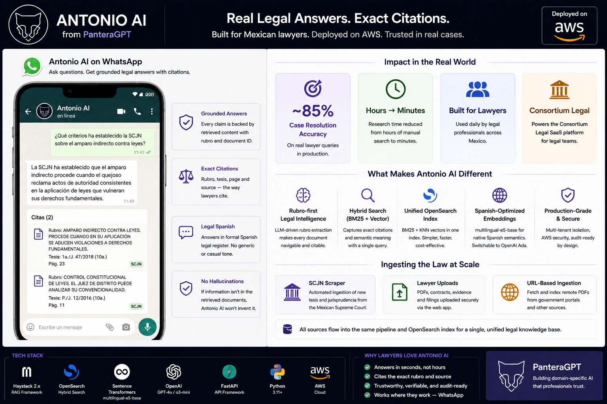
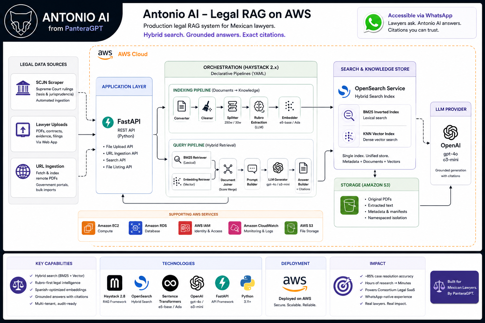
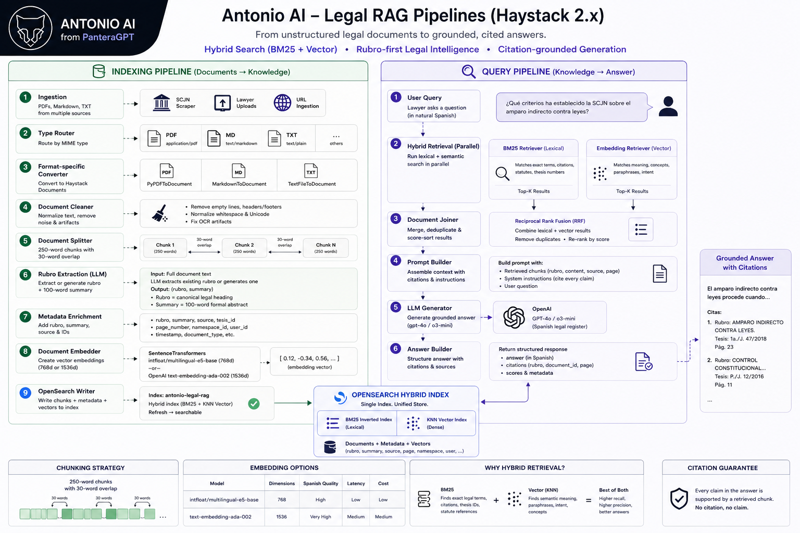

# panteragpt-rag

> **Production legal RAG system · Portfolio showcase.** Source code is proprietary.

A retrieval-augmented generation platform for the Mexican legal domain — ingesting scraped Supreme Court rulings, legal precedents, and statute documents into a hybrid search index, and exposing a Spanish-language legal assistant capable of citing the exact rulings it draws from.

Built on Haystack 2.x, OpenSearch hybrid retrieval, and a domain-specialised indexing pipeline that extracts the Mexican legal "rubro" — the canonical legal heading that lawyers use to navigate jurisprudence.

---

## Background

Mexican lawyers spend hours navigating Supreme Court rulings (*tesis* and *jurisprudencia*) to support their arguments. Each ruling is published as an unstructured PDF with inconsistent formatting, embedded scanned text, and Spanish legal terminology — none of which off-the-shelf RAG systems handle well.

The brief: build a legal AI assistant lawyers can talk to in WhatsApp that returns *grounded* answers — every claim must point to the specific ruling that supports it. No hallucinated citations, no paraphrased misquotes, no English-trained embeddings butchering Spanish legal language.

This system was deployed at **~85% case resolution accuracy** on real lawyer queries and powered the **Consortium Legal** SaaS product.

---

## Product

---

## Architecture

---

## The RAG Pipeline

### Indexing — Documents to Searchable Knowledge

The indexing pipeline is a declarative Haystack 2.x graph defined in YAML. Each document flows through file-type routing, format-specific conversion, cleaning, word-based splitting with overlap, LLM-driven Rubro extraction, embedding, and writing to OpenSearch.

**Type-aware conversion**
- `text/plain` → `TextFileToDocument`
- `application/pdf` → `PyPDFToDocument`
- `text/markdown` → `MarkdownToDocument`
- Routing happens automatically by MIME type — no per-document branching in application code

**Cleaning & chunking**
- `DocumentCleaner` strips empty lines, normalises whitespace, and handles Unicode artefacts left over from PDF OCR
- `DocumentSplitter` slices each ruling into **250-word chunks with 30-word overlap** — empirically tuned for the average length of a Mexican Supreme Court paragraph (which typically spans one full legal argument)

**Embedding**
- `SentenceTransformersDocumentEmbedder` with `intfloat/multilingual-e5-base` (768-dim) for native Spanish semantic representation — outperforms English-pretrained models on Spanish legal text by a wide margin
- Embedder is switchable to OpenAI `text-embedding-ada-002` (1536-dim) for higher fidelity at the cost of token usage; both pathways are wired into the pipeline YAML

### Legal Domain Specialisation — Rubro Extraction

In Mexican jurisprudence, every ruling is identified by its **rubro** — a short, canonical heading that summarises the legal principle being established. Lawyers cite by rubro the same way researchers cite by paper title.

The indexer extracts the rubro at ingestion time using an LLM-augmented step:

1. The full document text is passed to an LLM with a prompt instructing it to **extract the rubro if explicitly present** in the document header
2. **If no rubro is found, the LLM generates one** based on the document's core legal topic or conclusion — synthesising a navigable handle for unstructured filings
3. The output is regex-parsed into a `(rubro, summary)` pair — the summary is a 100-word formal Spanish abstract
4. Both are sanitised to ASCII-safe form for downstream metadata storage
5. They become first-class metadata fields on every chunk, making retrieved results immediately identifiable and citable

This single step turns a corpus of "PDF page 47" results into "*Rubro: Derecho a la salud, alcance constitucional* — page 47" — a citation lawyers actually trust.

### Query — Hybrid Retrieval

The query pipeline is a dual-path hybrid retriever — every question fans out across two retrieval methods simultaneously and merges their results. A **BM25 retriever** over the OpenSearch inverted index handles exact legal terminology, statute references, and case numbers. An **embedding retriever** over the OpenSearch KNN field handles semantic meaning, paraphrased concepts, and user intent. Both result sets flow into a **Document Joiner** that concatenates and score-sorts them before they reach the prompt builder, LLM generator, and citation-aware answer builder.

**Why hybrid, not dense-only?**
Pure dense retrieval misses exact-match queries — "Tesis 1a./J. 47/2018" is a citation, not a concept. Pure BM25 misses paraphrase — a user asking about "amparo indirecto contra leyes" should still match documents that discuss the same right under different wording. Combining both is non-negotiable for legal search where users mix conceptual questions with hard citations in the same conversation.

**OpenSearch as the unified store**
A single OpenSearch index holds both the inverted index (for BM25) and the KNN vector field (for dense retrieval) — eliminating the dual-database complexity of running a separate vector store alongside Elasticsearch. Both retrievers query the same underlying documents and merge results downstream.

### Generation — Grounded Answers with Citations

The retrieved chunks (top results from the joined hybrid output) are formatted into a Haystack `PromptBuilder` template and dispatched to the LLM (`gpt-4o` or `o3-mini`, configurable per environment).

The system prompt constrains the model to:
- **Cite the rubro and document ID** of every claim
- Refuse to answer if no retrieved chunk supports the claim
- Respond in **formal Spanish legal register** — the same register used in court filings

The `AnswerBuilder` then structures the response as `{answer, documents, scores}` so the frontend can render inline citations linking back to the source ruling.

---

## Key Engineering Decisions

### Declarative Pipelines via YAML
Indexing and query graphs are both defined as Haystack YAML — not Python code. This means:
- The retrieval architecture is **inspectable** without reading code
- Components can be swapped (embedder, retriever, LLM) by editing a config file, not a class
- Ops can promote a tuned pipeline from staging to production by copying a YAML file

### Switchable Embedding Backends
The pipeline supports two embedder backends through identical interfaces: `intfloat/multilingual-e5-base` for self-hosted Spanish-optimised inference, and OpenAI `text-embedding-ada-002` for cloud-grade fidelity. The dimensionality switch (768 ↔ 1536) is handled at index creation; the rest of the system is dimension-agnostic.

### S3-Backed File Storage with Namespace Isolation
Source PDFs are persisted to S3 at `uploads/{namespace_id}/{user_id}/{filename}` — multi-tenant isolation enforced by path, not application code. Presigned URLs grant time-limited access without exposing AWS credentials to the frontend. S3 object metadata mirrors the document's index metadata so the original file and its vector representation never drift apart.

### Synchronous Indexing API for Predictable UX
`POST /api/files` indexes uploaded documents synchronously and returns once they are queryable. For a legal tool where a lawyer expects to ask questions about a filing immediately after uploading it, eventual-consistency indexing is a worse UX than a slightly slower upload. A second endpoint `POST /api/files/from-url` does the same for remotely-hosted documents (used by the Supreme Court scraper).

### Date-Filtered Listing for Audit Trails
The file listing API supports namespace, user, and date-range filtering — built-in support for "show me everything indexed last week for client X", a requirement legal teams ask for the day they start using any tool.

---

## Ingestion Sources

The system ingests legal documents from three pipelines:

| Source | Method | Volume |
|---|---|---|
| **Mexican Supreme Court** (SCJN) | Automated scraper — fetches new *tesis* and *jurisprudencia* on a schedule | Tens of thousands of rulings |
| **Lawyer uploads** | Direct PDF upload via the Consortium Legal web UI | Per-case filings, contracts, evidence |
| **URL-based ingestion** | Remote PDFs fetched and indexed by reference | Bulk imports from government portals |

All three converge into the same indexing pipeline and the same OpenSearch index — a single retrieval surface across heterogeneous sources.

---

## API Surface

### Indexing
| Method | Endpoint | Purpose |
|---|---|---|
| `POST` | `/api/files` | Upload + index files synchronously |
| `POST` | `/api/files/from-url` | Fetch + index remote documents |
| `GET` | `/api/files` | List indexed files (namespace + user + date filters) |

### Query
| Method | Endpoint | Purpose |
|---|---|---|
| `POST` | `/api/search` | Hybrid retrieval + LLM-grounded answer, with structured citations |

---

## Tech Stack

| Layer | Technology |
|---|---|
| **RAG Framework** | Haystack 2.8 (declarative pipelines, YAML-defined graphs) |
| **API** | FastAPI · Pydantic · Uvicorn |
| **Vector / Search** | OpenSearch (hybrid: BM25 + KNN vectors in one index) |
| **Embeddings** | Sentence Transformers `intfloat/multilingual-e5-base` (768-dim) · OpenAI Ada (1536-dim) |
| **LLM** | OpenAI `gpt-4o` / `o3-mini` |
| **Document Processing** | PyPDF · Markdown · custom Spanish text cleaner |
| **Storage** | AWS S3 (namespaced uploads + presigned URLs) |
| **Domain Layer** | LLM-driven Rubro extraction · Spanish legal prompt templates · citation-grounded answer builder |

---

## What This Demonstrates

- **Hybrid retrieval architecture** — combining BM25 lexical search and dense vector retrieval through a unified OpenSearch index, with a downstream document joiner that score-merges both paths. Built for a domain where users mix exact citations and conceptual questions in the same query.
- **Domain-specialised indexing** — the Rubro extraction step is the difference between a "PDF search" and a "legal research" tool. Using the LLM as part of the *indexing* pipeline (not just generation) to surface domain-specific identifiers is a pattern that generalises to any field with canonical labelling (medical ICD codes, accounting GAAP references, scientific paper titles).
- **Multilingual semantic retrieval** — deliberate choice of `multilingual-e5-base` over English-pretrained alternatives for Spanish legal text, with a switchable path to OpenAI Ada for fidelity-vs-cost tuning per environment.
- **Declarative RAG pipelines** — both indexing and query graphs defined in Haystack YAML, making the retrieval architecture inspectable, swappable, and ops-portable without code changes.
- **Grounded answer generation** — every LLM response is constrained to cite the rubro and document ID of the retrieved chunks it draws from. Hallucinated citations are structurally hard, not just discouraged by prompt.
- **Production-grade multi-tenancy** — namespace-based isolation in both the S3 layer (path-scoped) and the OpenSearch metadata, with date-filtered listing for audit and compliance use cases.
- **End-to-end legal AI** — scraping Supreme Court rulings → indexing into hybrid search → answering lawyer queries in WhatsApp with grounded citations. Real users, real cases, real impact.

---

## Impact

- Powered the **Consortium Legal** SaaS platform serving practising Mexican lawyers
- Achieved **~85% case resolution accuracy** on real legal research queries
- Reduced research time on a typical case from hours to minutes
- WhatsApp-delivered — meeting lawyers where they already work, no new app to install

---

*Built by Ahmad Islam · [GitHub](https://github.com/ahmadaii)*

---

*License: Proprietary. All rights reserved.*
