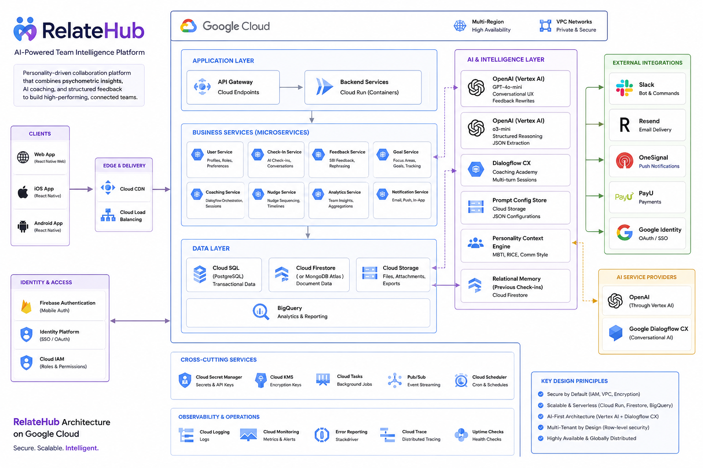

# RelateHub — AI-Powered Team Intelligence Platform

> **Portfolio project.** This repository is a public showcase. Source code is proprietary.

---

## What Is This?

RelateHub is a **personality-driven team collaboration SaaS** that helps managers and teams understand *how* they work together — not just *what* they produce. It combines psychometric profiling (MBTI, RICE motivational drivers), AI-powered coaching, and structured feedback loops to create a continuous improvement engine for team relationships.

The platform runs cross-platform (web, iOS, Android) from a single React Native codebase, with a Parse Cloud Code backend and deep OpenAI integration that personalises every interaction to each individual's personality type.

---

## The Problem It Solves

Most HR and performance tools measure output. RelateHub measures relationships. Teams underperform not because people lack skills, but because of communication mismatches, unspoken blockers, and misaligned working styles that never surface in traditional reviews.

RelateHub creates a structured cadence: recurring AI check-ins, personality-calibrated feedback, and coaching sessions that build psychological safety over time — with measurable improvements in how managers and teams relate to each other.

---

## Architecture



---

## How the AI Works

RelateHub uses a **dual-model strategy** — choosing the right model per task — and a distinctive **personality-as-context** pattern that threads psychometric data through every AI interaction.

### Dual-Model Strategy

| Model | Used For | Why |
|---|---|---|
| **GPT-4o-mini** | Feedback rephrasing, check-in chat, quick responses | Low latency, cost-efficient for high-frequency UX paths |
| **o3-mini** | Focus area extraction, check-in summarisation | Structured reasoning over complex multi-field JSON Schema |
| **Dialogflow CX** | Coaching Academy sessions | Multi-turn stateful conversations with intent detection |

### Personality-Aware Feedback

Every piece of feedback passes through a rephrasing step calibrated to the *recipient's* personality:

- **MBTI type** determines communication style (e.g. INTJ prefers direct, strategic framing; ESFP responds better to relational, emotionally resonant language)
- **RICE top driver** (Reward, Ideology, Coercion, Esteem) shapes motivational framing
- Each feedback field (Situation, Behaviour, Impact, Recommendation) is individually rephrased
- The rewritten version is stored — not generated at read time — so the personalised output is durable

### AI Check-In Engine

Recurring chat-based check-ins run on configurable weekly/bi-weekly/monthly schedules:

1. Structured prompt config (JSON, not hardcoded strings) selects question variations to avoid repetition
2. Conversation runs in natural language with a "supportive colleague" persona across 7 languages
3. GPT-4o-mini extracts blockers, highlights, and follow-ups into structured JSON
4. **Follow-ups from previous cycles are injected into the next prompt** — relational memory without a vector store
5. Manager dashboard surfaces extracted blockers as team-wide patterns

### Focus Area Generation

Users complete a goal-setting questionnaire. Answers are passed to o3-mini with a strict JSON Schema to extract focus areas with effort/impact classifications. Manager reviews and commits; focus areas anchor all future check-in conversations.

### Prompts as Configuration

Rather than hardcoded strings, all prompt logic lives in a structured JSON config:
- Multiple question variations per topic (Reflection, Focus, Issues & Needs)
- Tone adjustment logic based on emotional check-in response
- Transition templates between topics
- Response handling strategies for vague or one-word answers
- Language enforcement directive (7 languages) — preventing English defaults regardless of model behaviour

---

## Key Features

### For Team Members
- **Personality assessments** — MBTI, RICE motivational drivers, Communication Style profiling
- **AI check-ins** — conversational weekly/bi-weekly check-ins with memory of previous cycles
- **Feedback** — give and receive Situation→Behaviour→Impact structured feedback, with optional anonymity
- **Goal tracking** — AI-generated focus areas, effort/impact classification
- **Coaching Academy** — multi-turn Dialogflow-powered coaching sessions with progression unlocks
- **WorkSync** — team compatibility view, communication style contrast, collaboration tips
- **Personal insights dashboard** — patterns, trends, and growth over time

### For Managers
- **Team dashboard** — aggregated check-in summaries, surfaced blockers, team patterns
- **Nudge engine** — proactive prompted actions scheduled across 3/6/12-month timelines, sequenced from psychological safety to performance
- **Feedback analytics** — trend analysis and impact tracking across the team
- **Team health metrics** — psychological safety index, performance index
- **Manager notes** — private notes on team members
- **Coaching administration** — manage team members' coaching progression

### For HR
- Company-wide team health overview
- Aggregated performance and coaching metrics

### Slack Integration
- `/about {person}` — AI-generated personality-aware advice on how to work with a team member
- `/aboutyou` — MBTI-calibrated personal working style advice
- `/join` — Team onboarding flow directly from Slack

---

## Multi-Tenancy & Access Control

```
Company (top-level tenant)
    └── Team
          └── User (role: team_member / manager / hr)
```

- **Parse ACL** enforced at the database object level — no query ever crosses a company boundary
- Role-based capabilities: team members access personal data; managers access team data; HR accesses company-wide aggregates
- Privacy controls configurable per feature per role (`showAdviceCenter`, `showMatchWithMe`, `showDosAndDonts`)
- All AI calls scope context to the user's company and team

---

## Tech Stack

| Layer | Technology |
|---|---|
| **Frontend** | React Native + Expo 52, TypeScript, NativeWind, React Navigation v7 |
| **Cross-platform targets** | Web, iOS, Android (single codebase) |
| **UI** | Custom component library (atoms → components → layouts), Shadcn-style |
| **Localisation** | i18next (EN, PL, SE, DE, FR, IT, ES) |
| **Backend** | Parse Cloud Code (Node.js), Back4App managed hosting |
| **Database** | MongoDB via Parse |
| **LLM** | OpenAI GPT-4o-mini (Chat API), o3-mini (Responses API + JSON Schema) |
| **Conversation AI** | Google Dialogflow CX |
| **Messaging** | Slack Web API (bot + OAuth) |
| **Email** | Resend (HTML templates, batch sending) |
| **Push Notifications** | OneSignal |
| **Payments** | PayU |

---

## Notable Engineering Decisions

### Relational Memory Without a Vector Store
Check-in continuity is achieved by querying previous cycle summaries from MongoDB and injecting them directly into the next prompt — no embedding pipeline, no Qdrant, no semantic search. This keeps the architecture simple and cost-efficient while preserving the conversational context that makes check-ins feel personal and progressive.

### Personality as a First-Class Data Model
MBTI type and RICE top driver are stored on every user and threaded through every AI prompt. This isn't a display-layer concern — it's baked into the data model and prompt architecture. The same feedback, goal, or coaching nudge is genuinely different for different users because the personalisation happens at generation time, not rendering time.

### Structured Prompts as JSON Configuration
All AI prompt logic is externalised into a JSON config object rather than hardcoded strings. Question variations, tone adjustments, follow-up strategies, and language enforcement are all configured data. This means prompt iteration and A/B testing require no code changes or redeployment.

### Coaching Sessions as Persistent Event Chains
Each step in a Dialogflow coaching interaction is stored as a `CoachSessionStep` record with a `pastSteps` array. This enables asynchronous completion (users can pause and resume), progress tracking, unlock gates between modules, and full session replay — none of which Dialogflow natively provides.

### Nudge Engine with Sequenced Timeline
The nudge engine doesn't just schedule reminders — it sequences them intentionally. Early nudges focus on psychological safety actions; later nudges introduce performance content. The sequencing is configured per timeline (3/6/12 months) and ensures teams build trust before being pushed toward harder conversations.

---

## Data Model

```
Company ──┬── Team ──┬── User (MBTI · RICE · CommStyle · role)
          │          ├── CheckIn (chat history · blockers · follow-ups)
          │          ├── Feedback (SBI model · anonymous flag · rephrased fields)
          │          ├── Goal ── FocusArea (effort · impact · AI-generated)
          │          ├── Nudge (timeline · sequence · status)
          │          └── Meeting · Task
          │
          ├── CoachSession ── CoachSessionStep (pastSteps · Dialogflow state)
          └── Knowledge (articles · stories · ratings)
```

---

## What This Demonstrates

- **Personality-driven AI personalisation** — MBTI and RICE drivers threaded through every prompt, producing genuinely different outputs for different personality types rather than generic responses
- **Dual-model orchestration** — deliberate selection of GPT-4o-mini vs o3-mini per task based on latency, cost, and reasoning requirements
- **Stateful multi-turn AI sessions** — Dialogflow CX coaching sessions persisted as event chains, enabling async completion, progression gating, and replay
- **Relational memory pattern** — conversational continuity achieved through structured DB injection rather than embedding pipelines, demonstrating judgment about when RAG is and isn't the right tool
- **Cross-platform product engineering** — single React Native codebase targeting web, iOS, and Android with full i18n across 7 languages
- **Prompt engineering as a system** — structured JSON prompt configs with variation arrays, tone logic, and language enforcement, enabling iteration without code changes

---

*Built by Ahmad Islam · [GitHub](https://github.com/ahmadaii)*

---

*License: Proprietary. All rights reserved.*
