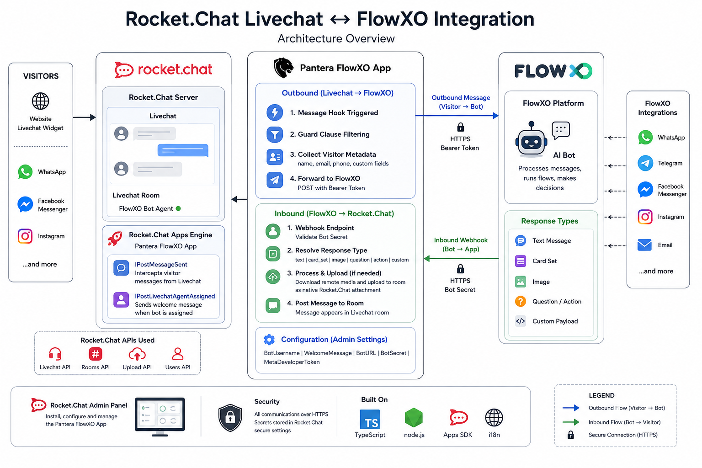

# rocketchat-pantera-flowxo

> **Internal integration app · Portfolio showcase.** Source code is proprietary.

A Rocket.Chat App that bridges Rocket.Chat Livechat and FlowXO — turning every incoming visitor conversation into an AI-handled interaction, with bidirectional message relay, rich media support, and automatic bot assignment.

---

## Background

The client needed their Rocket.Chat Livechat to be handled by a FlowXO AI chatbot — not by human agents waiting on shift. The challenge: Rocket.Chat and FlowXO are separate systems with no native integration. Messages need to flow in both directions, with visitor metadata, typing indicators, image attachments, and card-based rich responses all handled correctly.

I built this as a first-class Rocket.Chat App using the Rocket.Chat Apps SDK — installed directly into the Rocket.Chat server, no external middleware required. It intercepts outbound Livechat messages and proxies inbound FlowXO responses, creating the appearance of a seamless AI-powered support channel.

---

## Architecture

---

## How It Works

### Outbound — Livechat → FlowXO

When a visitor sends a message in Livechat:

1. The app's `IPostMessageSent` hook fires on every new message
2. A guard clause chain filters out irrelevant events: bot messages, non-livechat rooms, closed rooms, empty messages, edited messages
3. Visitor metadata is collected from the Livechat API: name, email, phone, custom fields
4. The message payload is forwarded to the FlowXO bot URL with Bearer token authentication
5. FlowXO processes the message and calls back via the app's inbound webhook

### Inbound — FlowXO → Rocket.Chat

FlowXO delivers responses to the app's registered HTTP endpoint:

1. The webhook authenticates the request against the configured bot secret
2. The response type is resolved: `text`, `card_set`, `image`, `question`, `action`, `custom`
3. **Text messages** are posted directly into the Livechat room
4. **Card sets** extract the card image, download it as a buffer, and upload it as a room attachment via the Rocket.Chat file upload API — rendered inline in the conversation
5. **Images** are similarly downloaded and uploaded as native Rocket.Chat attachments

### Bot Assignment — Welcome Message

When the FlowXO bot agent is assigned to an open Livechat room:

1. The app's `IPostLivechatAgentAssigned` hook fires
2. The configured welcome message is sent into the room immediately
3. This triggers the FlowXO bot to begin its opening flow — no manual initiation required

---

## Key Features

### Bidirectional Message Bridge
Full duplex relay between two systems that have no native awareness of each other. The app acts as a stateless proxy: every visitor message out, every bot response in, with no persistent state required between calls.

### Rich Media Handling
FlowXO card responses contain remote image URLs. Rather than sending a link the visitor would need to click, the app downloads the image server-side and uploads it directly to the Rocket.Chat room — delivering it as a native inline attachment indistinguishable from an uploaded file.

### Visitor Metadata Forwarding
Every outbound message includes the visitor's profile: name, email, phone, and any custom fields defined in Livechat. This gives the FlowXO bot full context on the first message — no back-and-forth asking for contact details.

### Configurable via Rocket.Chat Admin
Five settings managed entirely through the Rocket.Chat admin panel — no config files, no redeployment required:

| Setting | Purpose |
|---|---|
| `BotUsername` | Rocket.Chat username of the FlowXO bot agent |
| `WelcomeMessage` | First message sent when bot is assigned to a room |
| `BotURL` | FlowXO webhook URL for outbound messages |
| `BotSecret` | Bearer token for authenticating inbound FlowXO callbacks |
| `MetaDeveloperToken` | WhatsApp Cloud API developer token (extension point) |

### Multi-language Support
App strings (settings labels, descriptions) are fully i18n-ready with English and Spanish translations bundled — deployable to multilingual support teams without modification.

### Guard Clause Message Filtering
Rather than a complex conditional tree, the message handler uses a flat chain of early returns: not the bot → is livechat → room is open → has text content → not an edit. Each condition is a single check. If any fails, the handler exits immediately — keeping the hot path clean and the logic auditable.

---

## Rocket.Chat Apps SDK

This integration is built as a native Rocket.Chat App — not a bot, not a webhook script, but a first-class server-side extension:

- Declared lifecycle hooks (`IPostMessageSent`, `IPostLivechatAgentAssigned`) are registered with the Rocket.Chat runtime and called at the correct points in the message lifecycle
- HTTP endpoints registered via `ApiEndpoint` are served by Rocket.Chat directly — no separate web server needed
- Settings are managed through the standard Rocket.Chat Settings API with typed definitions
- Image uploads use the internal Rocket.Chat upload API — the same path the mobile client uses

The result is an integration that survives Rocket.Chat upgrades cleanly and can be installed, configured, and updated entirely through the admin UI.

---

## Business Impact

- **Automated 80% of lead capture** — the FlowXO bot handles initial qualification and routing, with human agents only stepping in for complex cases
- **40% increase in qualified leads** — consistent bot-driven qualification replaces patchy human availability
- **8-department rollout** — a single Rocket.Chat installation with this app served lead flows across 8 business units simultaneously

---

## Tech Stack

`TypeScript` `Rocket.Chat Apps SDK` `FlowXO Webhook API` `Rocket.Chat Livechat API` `Node.js` `i18n`

---

*Built by Ahmad Islam · [GitHub](https://github.com/ahmadaii)*

---

*License: Proprietary. All rights reserved.*
