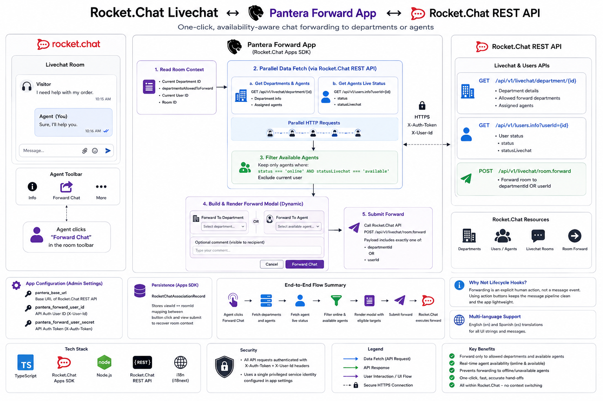

# rocketchat-pantera-forward

> **Internal integration app · Portfolio showcase.** Source code is proprietary.

A Rocket.Chat App that gives Livechat agents one-click chat forwarding — to the right department or the right available teammate — with live agent-availability filtering powered by the Rocket.Chat REST API.

---

## Background

In a multi-department Rocket.Chat Livechat operation, an agent who picks up the wrong conversation needs to hand it off — to another department, or to a specific teammate who's better equipped to handle it. The built-in Rocket.Chat forwarding flow surfaces every department and every agent, regardless of availability — leading to chats handed off to offline agents and slow re-routing.

I built this as a Rocket.Chat App that surfaces a focused, availability-aware forwarding modal directly in the room toolbar: only the departments allowed for the current room, only the agents actually online and available, and the current agent excluded from the list.

---

## Architecture

---

## How It Works

### Forward Flow

1. Agent clicks the **"Forward Chat"** button in the Livechat room toolbar
2. The app reads the room's department and its `departmentsAllowedToForward` list
3. In parallel, the app queries the Rocket.Chat REST API:
   - `GET /api/v1/livechat/department/{id}` — fetches department info and assigned agents for the current and all allowed destination departments
   - `GET /api/v1/users.info` — resolves each agent's live `status` and `statusLivechat`
4. Agents are filtered down to those who are **online AND available**, excluding the current user
5. A dynamic modal renders two mutually exclusive dropdowns: a department list and an agent list, plus an optional comment field
6. On submit, the app calls `POST /api/v1/livechat/room.forward` with the chosen `departmentId` or `userId` — Rocket.Chat handles the actual hand-off

### Why It's Not a Lifecycle Hook

This app deliberately avoids `IPostMessageSent` and similar lifecycle hooks. Forwarding is an explicit human decision triggered by an action button — making it event-hook-driven would add overhead to every Livechat message for a feature only used occasionally. The UI-action-driven design keeps the message hot path untouched.

---

## Key Features

### Live Agent Availability Filtering
Every time the forwarding modal opens, the app queries each candidate agent's current status — not a cached value. Only agents whose `status === 'online'` and `statusLivechat === 'available'` appear in the dropdown. Forwarding to an offline or unavailable agent is structurally impossible.

### Department-Aware Destination Lists
Forwarding options aren't a flat list of every department in Rocket.Chat. The app respects the per-room `departmentsAllowedToForward` configuration — keeping the agent's choices scoped to the routing rules the admin team has set up.

### Mutually Exclusive Forward Targets
Department forward and agent forward share a single modal but enforce strict mutual exclusivity at submit time: either a department OR an agent, never both. The `POST /room.forward` payload is built with exactly one routing key, matching Rocket.Chat's API contract.

### Async Pre-fetch with Persistence
When the button is clicked, the app's pre-fetch pass (departments + agents + statuses) can fire dozens of parallel HTTP calls. The result is composed into the modal blocks once, and the view-ID-to-room mapping is persisted via Rocket.Chat's `RocketChatAssociationRecord` model — so the submit handler can recover the full room context without re-fetching.

### Self-Exclusion from Forward Targets
The current user is filtered out of the agent dropdown automatically. An agent cannot accidentally forward a chat to themselves — a small UX detail that prevents a confusing failure mode.

### Multi-language Support
English and Spanish translations bundled for button labels, modal text, and settings descriptions — ready for multilingual support teams.

---

## Configuration

Three settings, managed through the Rocket.Chat admin panel:

| Setting | Purpose |
|---|---|
| `pantera_base_url` | Base URL of the Rocket.Chat REST API |
| `pantera_forward_user_id` | Authenticated user ID for API calls (`X-User-Id` header) |
| `pantera_forward_user_secret` | Auth token (`X-Auth-Token` header) |

API auth uses the standard Rocket.Chat token-pair headers — no OAuth, no service accounts, just a single privileged identity making the forwarding orchestration calls.

---

## Rocket.Chat REST API Integration

| Method | Endpoint | Purpose |
|---|---|---|
| `GET` | `/api/v1/livechat/department/{id}` | Get department info + assigned agents |
| `GET` | `/api/v1/users.info?userId={id}` | Get agent's live status |
| `POST` | `/api/v1/livechat/room.forward` | Execute the chat forward |

All requests are authenticated with `X-Auth-Token` + `X-User-Id` headers from app settings.

---

## Tech Stack

`TypeScript` `Rocket.Chat Apps SDK` `Rocket.Chat REST API` `Node.js` `i18n`

---

## What This Demonstrates

- **Event-driven UI without lifecycle hooks** — proving that not every Rocket.Chat App needs to hook into the message pipeline; action buttons + view submit handlers are often the cleaner integration surface
- **Parallel API orchestration** — composing department info, agent rosters, and availability statuses in a single modal-build pass rather than serial round-trips
- **Availability-aware routing** — replacing the static "all agents" forwarding UI with one that reflects who is actually working right now
- **Stateful modal interactions** — bridging the gap between the button-click context and the form-submit context using Rocket.Chat's persistence association model

---

*Built by Ahmad Islam · [GitHub](https://github.com/ahmadaii)*

---

*License: Proprietary. All rights reserved.*
