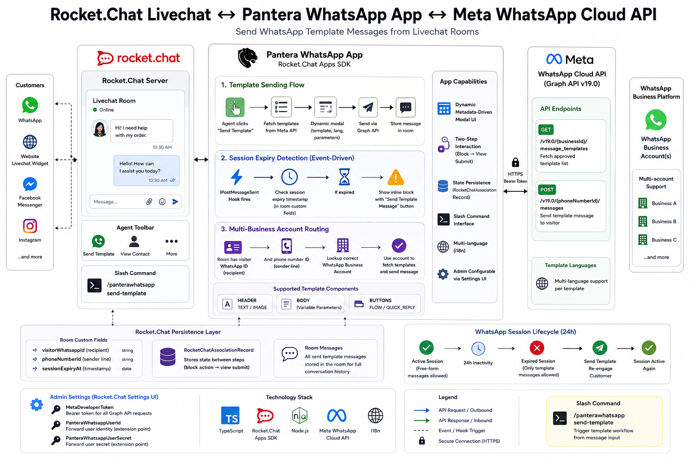

# rocketchat-pantera-whatsapp

> **Internal integration app · Portfolio showcase.** Source code is proprietary.

A Rocket.Chat App that enables agents to send WhatsApp template messages directly from Livechat rooms — with dynamic modal-driven template selection, session lifecycle management, and Meta WhatsApp Cloud API integration — without ever leaving Rocket.Chat.

---

## Background

WhatsApp Cloud API sessions expire after 24 hours of inactivity. When a session expires, agents cannot send free-form messages — they can only re-engage the customer using pre-approved WhatsApp message templates. Doing this from a separate WhatsApp Business Manager dashboard means context-switching, manual copy-pasting of customer numbers, and no record of outbound messages in Rocket.Chat.

I built this as a native Rocket.Chat App that surfaces the entire template workflow inside the Livechat UI: browse templates, fill parameters, send — all without leaving the conversation. Session expiry is detected automatically and agents are prompted at exactly the right moment.

---

## Architecture

---

## How It Works

### Template Sending Flow

1. An agent clicks the **"Send Template"** action button in the Livechat room toolbar
2. The app fetches the template list from Meta's WhatsApp Cloud API for the contact's linked business account
3. A dynamic modal renders: template selector, language picker, and input fields generated on-the-fly based on the selected template's component structure (header image/text, body parameters, flow buttons)
4. On submission, the app constructs the full template payload — components, parameters, language code — and sends it to `POST /messages` via the Graph API
5. The sent message is stored as a Rocket.Chat room message, keeping the full conversation history in one place

### Session Expiry Detection

The `IPostMessageSent` hook runs on every Livechat message:

- Room custom fields store the WhatsApp Cloud session expiration timestamp
- On each message, current time is compared against the stored expiry
- If the session has lapsed, an inline block message appears in the room with a **"Send Template Message"** button — prompting the agent to re-engage with an approved template before replying further
- This is passive, event-driven detection: no polling, no background jobs

### Multi-Business Account Routing

The app resolves the correct WhatsApp Business Account for each contact using a phone number ID lookup table. Each Livechat room stores the visitor's WhatsApp ID and the contact's phone number ID — the app maps these to the right business account to fetch the correct template set and authenticate the send request.

---

## Key Features

### Metadata-Driven Modal UI
The template modal is entirely dynamic — no hardcoded form. When an agent selects a template, the modal re-renders with exactly the right input fields: a text box for each body parameter, an image URL field if the header is `IMAGE` type, a language code selector. One modal serves every template without any layout logic per template.

### Two-Step Template Interaction
Template sending is a two-step interaction:
1. **Block action** — agent selects template → modal opens with dynamic fields
2. **View submit** — agent fills fields → app constructs API payload and fires the send request

State between the two steps is persisted via Rocket.Chat's `RocketChatAssociationRecord` layer — no external storage needed, no session cookies.

### Session Context via Room Custom Fields
All WhatsApp contact metadata lives in Rocket.Chat room custom fields:
- Visitor WhatsApp ID (the recipient)
- Contact phone number ID (the sender line)
- Session expiration timestamp

This keeps the integration stateless: any handler can reconstruct full context from the room alone.

### Admin-Configurable via Settings UI

| Setting | Purpose |
|---|---|
| `MetaDeveloperToken` | Bearer token for all Graph API requests |
| `PanteraWhatsappUserId` | Forward user identity (extension point) |
| `PanteraWhatsappUserSecret` | Forward user secret (extension point) |

No config files, no environment variables — fully managed through the Rocket.Chat admin panel.

### Slash Command Interface
`/panterawhatsapp send-template` — triggers the same template workflow from the message input bar, giving agents a keyboard-driven alternative to the toolbar button.

### Multi-language Support
App strings are fully translated in English and Spanish. Template language is selected per-send from the template metadata, so the same template can be dispatched in any language the Meta business account has approved.

---

## WhatsApp Cloud API Integration

**API:** Meta Graph API v19.0  
**Auth:** Bearer token  
**Endpoints used:**

| Method | Endpoint | Purpose |
|---|---|---|
| `GET` | `/v19.0/{businessId}/message_templates` | Fetch approved template list |
| `POST` | `/v19.0/{phoneNumberId}/messages` | Send template message to visitor |

**Template payload supports:**
- `HEADER` — `TEXT` or `IMAGE` (via public URL)
- `BODY` — variable text parameters (mapped to form inputs)
- `BUTTONS` — `FLOW` type (WhatsApp Flows) and `QUICK_REPLY` type

---

## Tech Stack

`TypeScript` `Rocket.Chat Apps SDK` `Meta WhatsApp Cloud API (Graph API v19.0)` `Rocket.Chat Livechat API` `Node.js` `i18n`

---

## What This Demonstrates

- **Native Rocket.Chat App development** — lifecycle hooks, registered UI elements (action buttons, slash commands), persistence layer, and modal interactions all using the Apps SDK
- **Dynamic UI generation from API metadata** — modal field structure derived at runtime from template component definitions, not hardcoded per template
- **Event-driven session management** — passive expiry detection via `IPostMessageSent` rather than polling, delivering just-in-time agent prompts exactly when needed
- **Multi-step stateful interactions** — block action → view submit flow with intermediate state persisted via Rocket.Chat's association model
- **WhatsApp Business API integration** — multi-account routing, template parametrisation, and component-level payload construction for production WhatsApp Cloud delivery

---

*Built by Ahmad Islam · [GitHub](https://github.com/ahmadaii)*

---

*License: Proprietary. All rights reserved.*
