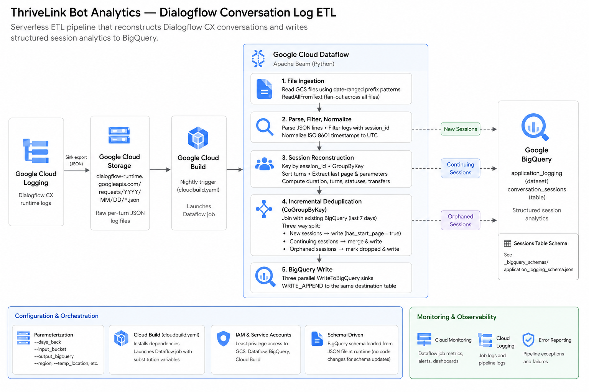

# ThriveLink Bot Analytics — Dialogflow Conversation Log Pipeline

> **Portfolio project.** This repository is a public showcase. Source code is proprietary.

---

## What Is This?

A **serverless, distributed data pipeline** that ingests raw Google Dialogflow CX conversation logs, reconstructs complete user sessions, and writes structured analytics records to BigQuery — enabling the ThriveLink product team to track chatbot/voicebot performance, measure program completion rates, and identify where users drop off.

The pipeline runs on **Google Cloud Dataflow** (Apache Beam), triggered nightly via **Google Cloud Build**, and supports configurable backfill for any number of historical days.

---

## The Problem It Solves

Dialogflow CX emits raw per-turn log entries to Google Cloud Logging, which are then exported to GCS as individual JSON files. Each file represents a single interaction turn — not a full conversation. A 10-turn conversation produces 10 separate JSON blobs with no direct relationship between them other than a shared `session_id` label.

**Challenges the pipeline solves:**

- **Session fragmentation** — Turn-level logs must be grouped, sorted, and merged into coherent sessions before any analytics are possible
- **Incremental deduplication** — The pipeline runs daily; sessions that span midnight, or are still active, must be updated rather than duplicated
- **Partial session detection** — Sessions may end cleanly (user completes the flow), drop silently (user abandons), or transfer to a human agent — each requires different handling
- **Deeply nested Dialogflow payloads** — Parameters, current page, trace blocks, and flow state are buried at varying depths across different log types; extracting them reliably requires traversal logic

---

## Architecture



---

## Pipeline Stages — In Depth

### 1. File Ingestion
Computes date-ranged GCS path patterns based on `--days_back` parameter:
```
gs://{bucket}/dialogflow-runtime.googleapis.com/requests/2024/11/14/*.json
```
Uses `ReadAllFromText` to fan out across all matching files — handles arbitrarily large log volumes without loading everything into memory.

### 2. Parse, Filter, Normalize
- `parse_json_line` — deserializes each line; malformed records are dropped cleanly
- `has_session` — filters out system/infrastructure logs that lack a `labels.session_id`
- `normalize_timestamp` — parses ISO 8601 timestamps with fractional seconds and timezone-normalizes to UTC `datetime` objects

### 3. Session Reconstruction
Logs are keyed by `session_id` and grouped with `GroupByKey`. For each group, `sort_and_transform` does the heavy lifting:

- **Sorts** turns by timestamp (ascending)
- **Walks backwards** through turns to extract the most recent `currentPage` and conversation `parameters` — handles the nested Dialogflow schema variations (`currentPage`, `traceBlocks → flowStateUpdate → pageState`)
- **Date normalization** — `dob` parameters arrive in multiple formats (`YYYY-MM-DD`, `DD-MM-YYYY`, dict `{year, month, day}`) and are all normalized to `YYYY-MM-DD`
- **Session status logic:**
  - `ended` — last page displayName is `"End Session"`
  - `dropped` — session started more than 1 hour ago and never reached `End Session`
  - `active` — session is less than 1 hour old and still in progress
- **Application status:**
  - `completed` — reached `End Session` OR a `submitted=true` parameter was found
  - `incomplete` — everything else
- **Transfer detection** — extracts `is_transferred` and `transferred_to` parameters for sessions handed off to human agents

### 4. Incremental Deduplication (CoGroupByKey)
The most complex stage. Reads existing BigQuery records from the last 7 days and joins them with the newly processed sessions:

| Scenario | Action |
|---|---|
| Session in incoming only (new) | Write if `has_start_page = true` (filters test/incomplete sessions) |
| Session in both (continuing) | Merge: replace mutable fields (last page, program, parameters) + sum numeric fields (duration, turns) |
| Session in existing only (orphaned) | Mark `session_status = "dropped"`, set `session_end_time = last_message_time` |

This three-way split is implemented with a single `CoGroupByKey` + three `FlatMap` branches — avoiding separate read passes and keeping the pipeline to a single Dataflow job.

### 5. BigQuery Write
Three parallel `WriteToBigQuery` sinks write to the same destination table using `WRITE_APPEND`. Schema is loaded from `_bigquery_schemas/application_logging_schema.json`.

---

## BigQuery Output Schema

| Field | Type | Description |
|---|---|---|
| `session_id` | STRING | Dialogflow session identifier |
| `agent_id` | STRING | Dialogflow CX agent ID |
| `session_start_time` | TIMESTAMP | First turn timestamp |
| `session_end_time` | TIMESTAMP | End Session page timestamp (if reached) |
| `last_message_time` | TIMESTAMP | Most recent turn timestamp |
| `last_message_from` | STRING | `"user"` or `"agent"` |
| `session_duration` | FLOAT | Seconds between first and last turn |
| `total_turns` | INTEGER | Number of conversation turns |
| `last_page_id` | STRING | Dialogflow page resource name |
| `last_page_name` | STRING | Human-readable page display name |
| `organization_id` / `organization_name` | STRING | Extracted conversation parameters |
| `program_id` / `program_name` | STRING | Healthcare program context |
| `patient_number` | STRING | Patient identifier (extracted parameter) |
| `call_sid` | STRING | Telephony call SID (for voicebot sessions) |
| `application_status` | STRING | `completed` / `incomplete` |
| `session_status` | STRING | `active` / `dropped` / `ended` |
| `has_start_page` | BOOLEAN | Whether session began from the start page |
| `is_transferred` | BOOLEAN | Whether call was transferred to a human agent |
| `transferred_to` | STRING | Transfer destination |
| `parameters` | RECORD (REPEATED) | Full `{name, value}` parameter array from the conversation |

---

## Deployment

Triggered via **Google Cloud Build** (`cloudbuild.yaml`). The build step installs dependencies and launches a Dataflow job with configurable substitution variables:

```yaml
steps:
  - name: 'python:3.11'
    entrypoint: bash
    args:
      - -c
      - |
        pip install -r requirements.txt
        python3 cloudlogging_to_bigquery.py \
          --project=$PROJECT_ID \
          --runner=DataflowRunner \
          --region=us-central1 \
          --temp_location=$_TEMP_LOCATION \
          --output_bigquery=$_OUTPUT_BIGQUERY \
          --days_back=$_DAYS_BACK \
          --input_bucket=$_INPUT_BUCKET \
          --requirements_file=requirements.txt \
          --save_main_session
```

To backfill historical data, increment `--days_back`. To update a running Dataflow job in place, pass `--job_name` matching the existing job — Dataflow handles the streaming update without downtime.

---

## Tech Stack

| Component | Technology |
|---|---|
| **Pipeline framework** | Apache Beam (Python SDK) |
| **Execution runtime** | Google Cloud Dataflow |
| **Log source** | Google Cloud Logging → GCS export |
| **Storage** | Google Cloud Storage (JSON files) |
| **Analytics sink** | Google BigQuery |
| **CI / deployment** | Google Cloud Build |
| **Chatbot platform** | Google Dialogflow CX |
| **Language** | Python 3.11 |

---

## Notable Engineering Decisions

### Backward-Walk Parameter Extraction
Dialogflow CX parameters accumulate across turns — a parameter set in turn 3 may be the only value ever captured for that field. Rather than inspecting only the final turn, the pipeline walks backwards through sorted turns and stops as soon as both `currentPage` and `parameters` are found. This maximizes completeness while keeping complexity O(n) per session.

### Multi-Path Page Detection
The `has_start_page` check traverses three different structural locations where the start page signal can appear in Dialogflow logs (`currentPage.displayName`, `traceBlocks → actions → flowStateUpdate → pageState`, and a commented-out `diagnosticInfo.execution_sequence` path). This resilience was needed because Dialogflow's log schema varies by agent version and interaction type.

### Three-Branch CoGroupByKey Deduplication
Rather than running separate read/write passes for new vs. updating vs. orphaned sessions, a single `CoGroupByKey` produces all three categories from one join. Each branch then writes to the same BigQuery table. This keeps the job to a single graph with no redundant I/O.

### Polymorphic Date Normalization
The `dob` field arrives from different Dialogflow parameter types in at least four formats: ISO string, US-format string, two-digit-year string, and a structured dict `{year, month, day}`. A single `convert_to_date` function handles all cases and normalizes to `YYYY-MM-DD` for consistent downstream querying.

### Schema-Driven BigQuery Writes
The BigQuery table schema is loaded from an external JSON file at runtime rather than hardcoded in the pipeline. This means schema changes (adding fields, changing modes) are a config-only operation — no code changes or redeployment needed.

---

## What This Demonstrates

- **Distributed data engineering** — Apache Beam on Dataflow handles arbitrarily large log volumes with horizontal scaling, fan-out file reads, and shuffles across the full session join
- **Real-world data messiness** — The pipeline handles all the rough edges of production Dialogflow logs: schema variations across agent versions, inconsistent timestamp formats, partially-captured sessions, and multi-turn parameter accumulation
- **Stateful incremental processing** — The CoGroupByKey deduplication pattern is a production-grade solution to the daily-batch-over-streaming-data problem, avoiding both missed updates and duplicate rows
- **Healthcare domain context** — Patient numbers, program IDs, transfer-to-care-team signals, and application completion tracking reflect real requirements from a regulated healthcare environment

---

*Built by Ahmad Islam · [GitHub](https://github.com/ahmadaii)*

---

*License: Proprietary. All rights reserved.*
