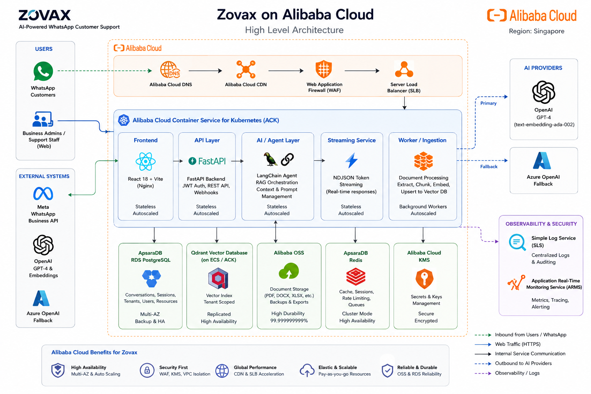
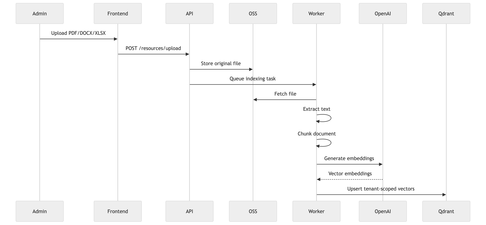
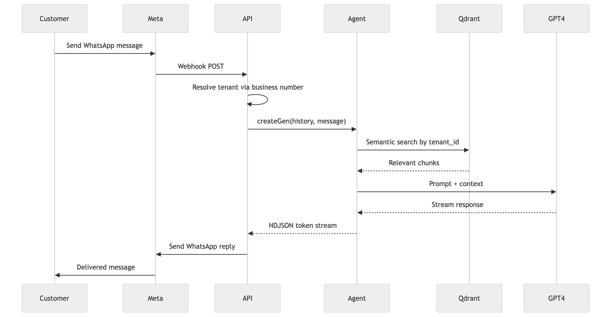
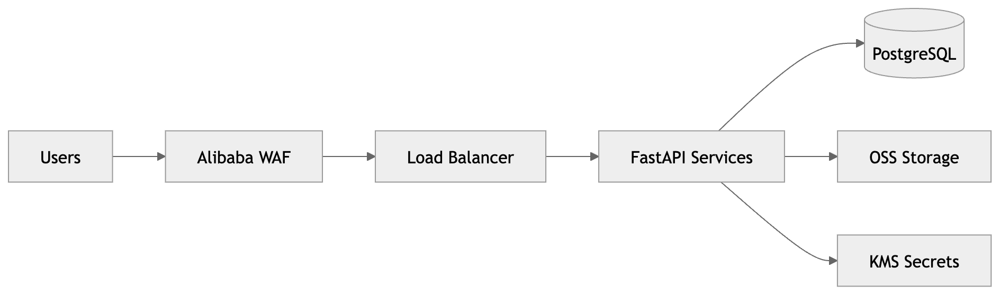

# Zovax — AI-Powered WhatsApp Customer Support Platform

> **Portfolio project.** This repository is a public showcase. Source code is proprietary.

---

## What Is This?

Zovax is a **multi-tenant SaaS platform** that enables SMEs to deploy AI-powered customer support via WhatsApp — without hiring a support team. Businesses connect their WhatsApp Business number, upload their knowledge base (PDFs, docs, spreadsheets), and Zovax handles all incoming customer conversations automatically using RAG-grounded GPT-4 responses.

The platform ships with a web dashboard for knowledge base management, conversation history, and a built-in chat interface for internal use — all isolated per tenant with JWT auth and Qdrant-backed vector search.

---

## The Problem It Solves

SMEs lose customers to slow or unavailable support. Hiring agents is expensive and doesn't scale. WhatsApp is where their customers already are, but building a custom AI bot requires engineering expertise most small businesses don't have.

Zovax gives any business a production-ready AI support agent in minutes: connect a WhatsApp number, upload your product docs, and the bot starts answering questions grounded in your actual knowledge base — not hallucinations.

---

## Architecture



---

## How the AI Works

### RAG Ingestion Pipeline



1. **Upload** — Business uploads docs (PDF, DOCX, PPTX, XLSX, CSV, TXT) via dashboard
2. **Extract** — Background worker fetches file from OSS and extracts text per file type
3. **Chunk** — Split into 1,000-token chunks with 200-token overlap
4. **Embed** — Each chunk embedded with OpenAI Ada (`text-embedding-ada-002`, 1,536 dims)
5. **Store** — Upserted to Qdrant with tenant-scoped metadata payload

### Conversation Flow



### Streaming (Web Chat)

The web chat uses the same agent but streams tokens to the browser:

- Backend yields newline-delimited JSON events: `session`, `log`, `token`, `final_token`, `error`
- Frontend collects tokens and renders incrementally
- If user navigates away mid-stream, client calls `/conversation/save_partial` to preserve the partial response
- On completion, the partial row is upgraded to a full conversation record — no duplicates

---

## Key Features

### For Businesses (Admin)
- **Knowledge Base** — Upload any document type; background indexing with progress feedback
- **Resource Management** — Edit, categorise, download, or delete uploaded files
- **Conversation History** — Full session and message history per WhatsApp user
- **Web Chat** — Internal AI assistant interface using the same RAG-grounded agent
- **Multi-Tenant Isolation** — Each company's data, vectors, and conversations are fully isolated

### For Customers
- **WhatsApp-native** — No app to download, no account to create
- **Instant AI responses** — Grounded in the business's actual knowledge base
- **Conversation context** — Full history maintained across messages within a session

---

## Security & Multi-Tenancy



| Layer | How Isolation is Enforced |
|---|---|
| **Database** | `tenant_id` FK on every table; queries always scoped |
| **Vector DB** | All Qdrant queries filter by `tenant_id` payload field |
| **WhatsApp** | Incoming webhook resolves tenant by matching business phone number |
| **JWT** | Token encodes `tenant_id`; backend enforces on every API call |

---

## Tech Stack

| Layer | Technology |
|---|---|
| **Frontend** | React 18, TypeScript, Vite, TailwindCSS, Shadcn/ui, React Query |
| **Backend** | FastAPI, Python, SQLAlchemy 2.0, Alembic |
| **Database** | PostgreSQL 15 |
| **Vector Store** | Qdrant (binary quantization, COSINE distance, 1,536 dims) |
| **LLM** | OpenAI GPT-4 (`gpt-4-0125-preview`), Azure OpenAI fallback |
| **Embeddings** | OpenAI Ada (`text-embedding-ada-002`) |
| **Agent Framework** | LangChain (OPENAI_FUNCTIONS agent, StructuredTool) |
| **Messaging** | Meta WhatsApp Business API (Graph API v22.0) |
| **File Storage** | Alibaba OSS |
| **Auth** | JWT (HS256), Argon2 password hashing |
| **Deployment** | Docker Compose, Nginx |

---

## Notable Engineering Decisions

### Tenant Resolution via Phone Number
WhatsApp webhooks carry no user session — just the sender and receiver phone numbers. The business phone number in the webhook payload is used to reverse-lookup the tenant, map to their knowledge base, and scope the entire AI response. This required a careful phone normalisation layer that handles `+966`, `00966`, `0573...` formats and strips bidirectional control characters.

### Dual-Write Streaming Pattern
The assistant's response is streamed token-by-token to the frontend. To handle mid-stream aborts (user navigates away), the client calls a `save_partial` endpoint that upserts an incomplete record. When the stream completes normally, the final write upgrades the same row. The `client_req_id` UUID sent with every request ensures idempotent saves — retries never create duplicates.

### Idempotent Resource Indexing
File uploads trigger a background Alembic-safe task: extract text → chunk → embed → upsert to Qdrant. Each chunk's Qdrant point ID is deterministically derived from `(tenant_id, resource_id, chunk_index)`, so re-uploads overwrite rather than append, keeping the index consistent without a separate delete-before-insert step.

### Graceful OSS Degradation
Alibaba OSS is optional. If credentials are absent, the system falls back to inline text storage in PostgreSQL. This allows the platform to run fully locally with `docker-compose up` — no cloud dependencies needed for development or demos.

---

## Data Model

```
Tenant ──┬── User (role: owner / user)
         │     └── Session ── Conversation (messages)
         │
         ├── Resource (uploaded files + OSS refs)
         │     └── Qdrant points (tenant-scoped vectors)
         │
         ├── WhatsAppUser (phone-based customer identity)
         └── WhatsAppSession ── WhatsAppConversation
```

---

## Deployment

Full stack runs with a single command:

```bash
docker-compose up
```

| Service | Port | Role |
|---|---|---|
| Nginx | 8080 | Reverse proxy — routes `/api/*` to backend, `/` to frontend |
| FastAPI backend | 8000 | API + webhook handler |
| React frontend | 3000 | SPA served via Nginx |
| PostgreSQL 15 | 5332 | Relational store |
| Qdrant | 6333 / 6334 | Vector DB (HTTP / gRPC) |

---

## What This Demonstrates

- **WhatsApp Business API integration** — Webhook handling, tenant resolution by phone, response delivery via Meta Graph API
- **Production RAG** — Multi-format document ingestion, tenant-scoped Qdrant vector search, token-budget-aware context assembly, and GPT-4 grounded responses
- **Multi-tenant SaaS patterns** — Isolation enforced at DB, vector DB, API, and JWT layers simultaneously
- **Streaming UX engineering** — Token streaming, partial save on abort, idempotent writes, and client-side incremental rendering
- **Dockerised full-stack delivery** — Single `docker-compose up` spins the entire stack including vector DB, with health checks and graceful startup ordering

---

*Built by Ahmad Islam · [GitHub](https://github.com/ahmadaii)*

---

*License: Proprietary. All rights reserved.*
